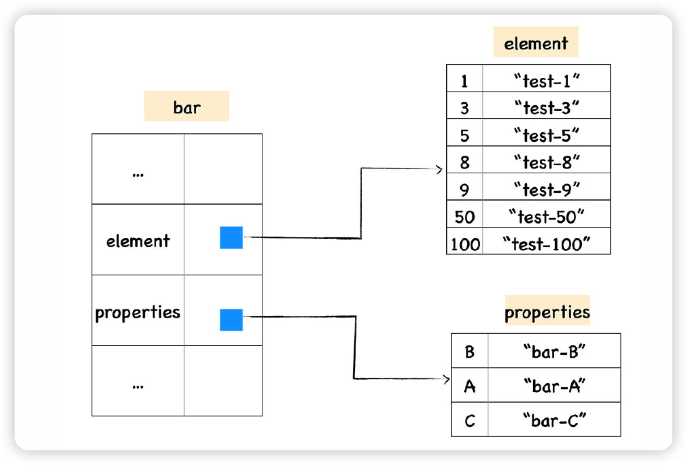
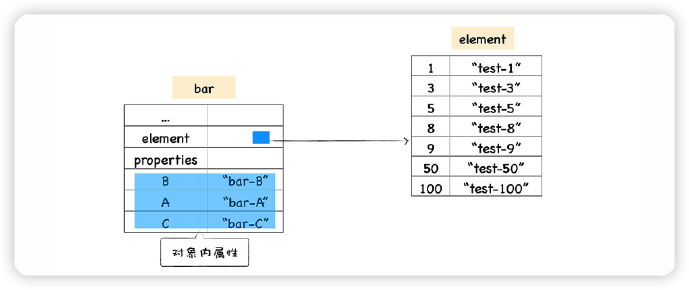
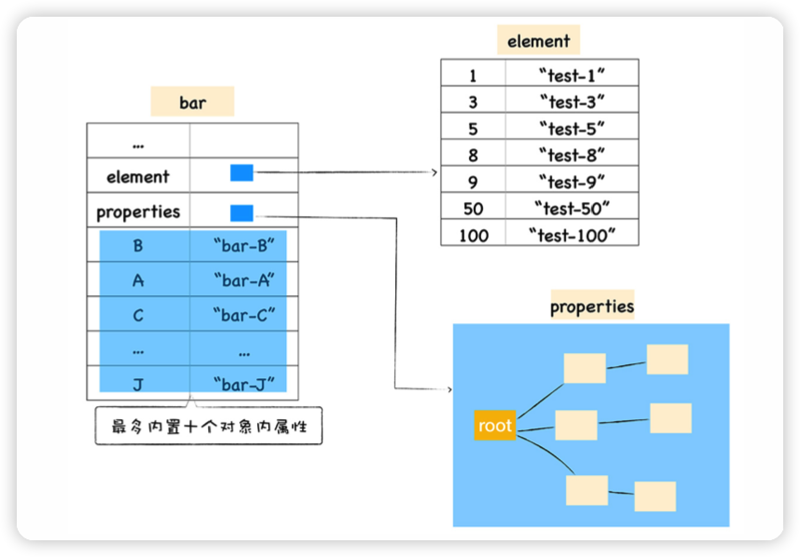
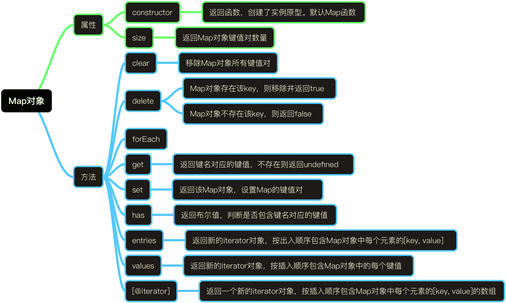

# ✈️ JavaScript对象+MAP实现原理 ✈️ 

> * 常规属性（properties）和排序属性（element）
> * 对象内属性 (in-object properties)
> * 快属性（fast）和慢属性（slow）
> * 快数组（fastElement）和慢数组（slowElement）

## 对象 Object  🚗

JavaScript 对象像一个字典是由一组组属性和值组成的，由map(map 一般也称为 HiddenClass)、propertiesOrHash、elements三个内置属性组成，所以最简单的方式是使 用一个字典来保存属性和值，但是由于字典是非线性结构，所以如果使用字典，读取效率会 大大降低。

V8 为了提升存储和查找效率，V8 在对象中添加了两个隐藏属性，排序属性和常规属性， element 属性指向了 elements 对象，在 elements 对象中，会按照顺序存放排序属性。 properties 属性则指向了 properties 对象，在 properties 对象中，会按照创建时的顺序保存 常规属性。

### 1. 常规属性 (properties) 和排序属性 (element)

```js
/*
* 1.数字属性被最先打印出来了，并且是按照数字大小的顺序打印的
* 2.设置的字符串属性依然是按照之前的设置顺序打印的
* 原因:ECMAScript 规范中定义了数字属性应该按照索引值大小升序排列，字符串属性根据创建 时的顺序升序排列
*/
function Foo() {
  this[100] = 'test-100'
  this[1] = 'test-1'
  this["B"] = 'bar-B'
  this[50] = 'test-50'
  this[9] =  'test-9'
  this[8] = 'test-8'
  this[3] = 'test-3'
  this[5] = 'test-5'
  this["A"] = 'bar-A'
  this["C"] = 'bar-C'
}
var bar = new Foo()
for(key in bar){
  console.log(`index:${key}  value:${bar[key]}`)
}
console.log(bar);
```

在对象中的数字属性称为排序属性，在 V8 中被称为 *elements*(elements 对象中，会按照 顺序存放排序属性)，inobject 属性知道了其属性值的索引之后，直接根据对象的首地址进 行偏移即可， fast 和 inobject 是互补的。
 默认情况下，添加的属性优先按 inobject 形式进行处理，当整体 inobject 属性的数量超过一定上限时，属性会被添加到 fast 的 PropertyArray 中。
 字符串属性就被称为常规属性，在 V8 中被称为 *properties*(按照创建时的顺序保存了常规属性)。bar 对象恰好包含了这两个隐藏属性。



如上在 V8 内部，为了有效地提升存储和访问这两种属性的性能，分别使用了两个线性数据 结构来分别保存排序属性和常规属性。分解成这两种线性数据结构之后，如果执行索引操 作，那么 V8 会先从 elements 属性中按照顺序读取所有的元素，然后再在 properties 属性 中读取所有的元素，这样就完成一次索引操作。

### 2.我们来验证打印一下

当我们在浏览器里打印出来以后，并没有发现 *properties*  原因是bar.B这个语句来查找 B 的属性值，那么在 V8 会先查找出 properties 属性所指向的对象 properties，然后再在 properties 对象中查找 B 属性，这种方式在查找过程中增加了一步操作，因此会影响到元素 的查找效率。

所以V8 采取了一个权衡的策略以加快查找属性的效率，这个策略是将部分常规属性直接存 储到对象本身，我们把这称为对象内属性 (in-object properties)。对象在内存中的展现形式 你可以参看下图:



不过对象内属性的数量是固定的，默认是 10 个，如果添加的属性超出了对象分配的空间， 则它们将被保存在常规属性存储中。虽然属性存储多了一层间接层，但可以自由地扩容。 保存在线性数据结构中的属性称之为“快属性”，因为线性数据结构中只需要通过索引即可以 访问到属性，虽然访问线性结构的速度快，但是如果从线性结构中添加或者删除大量的属性 时，则执行效率会非常低，这主要因为会产生大量时间和内存开销。 因此，如果一个对象的属性过多时，V8 就会采取另外一种存储策略，那就是“慢属性”策 略，但慢属性的对象内部会有独立的非线性数据结构 (词典) 作为属性存储容器。所有的属性 元信息不再是线性存储的，而是直接保存在属性字典中。



```js
// 我们一起测试一下V8
function Foo(property_num,element_num) {
	//添加可索引属性
	for (let i = 0; i < element_num; i+() {
        this[i] = `element${i}`
    }
	 // 添加常规属性
		for (let i = 0; i < property_num; i+() {
        let ppt = `property${i}`
        this[ppt] = ppt;
    }
}
  var bar = new Foo(10,10)
  // 貌似哪里有些问题?
  // The number of in-object properties is predetermined by the initial size of the object.
  function init(){
    var yideng  ={
      0:"item0",
      1:"item1",
      2:"item2",
      3:"item3",
      4:"item4",
      5:"item5",
      6:"item6",
      7:"item7",
      "yideng1":"item-yideng1"
    }
    return function apple(){
      console.log(yideng);
    }
  }
  var result = init();
  result();
```

通过引入这两个属性，加速了 V8 查找属性的速度，为了更加进一步提升查找效率，V8 还实 现了内置属性的策略，当常规属性少于一定数量时，V8 就会将这些常规属性直接写进对象 中，这样又节省了一个中间步骤。

最后如果对象中的属性过多时，或者存在反复添加或者删除属性的操作，那么 V8 就会将线 性的存储模式降级为非线性的字典存储模式，这样虽然降低了查找速度，但是却提升了修改 对象的属性的速度。

```c
 
代码调用V8内部查看
//node -+allow-natives-syntax test.js
//inobject properties 数量是 1，这里没有 8 个的预留空间， const a = { p1: 1 };
%DebugPrint(a);
//当创建空对象的时候，inobject properties 数量是 4
const a = {};
%DebugPrint(a);
```

inobject 和 fast 都是「偏静态」的优化手段，而 slow 则是完全动态的形式，当对象频繁地 动态添加属性、或者执行了 delete 操作，则预测它很可能未来还会频繁的变动，那么使用 纯动态的形式可能会更好，所以切换成 slow 模式。当你把一个对象给到一个函数的原型链 的时候他会⻢上切换为slow

在 V8 的新版本(≥ 6.0)中，提供了一个新途径，当删除的属性满足如下 6 点条件时对象不 会退化为字典模式:

1. 对象是常规 JavaScript 对象。
2. 传入的属性名是常量化字符串(不可是变量)或 Symbol。
3. 删除的属性是最后添加到对象内的。
4. 此属性是可以被删除的。
5. backpointer引用的类型必须是 。
6. 最后一次 Map Transition 只能由于对象新增属性而触发。

### 小结

我们可以将如上部分小结如下:

* 对象的属性有三种模式:inobject，fast(elements)，slow(properties) 
* 三种模式的属性访问效率由左往右递减
*  属性默认使用 inobject 型，超过预留配额后，继续添加的属性属于 fast 型
* 当继续超过 fast 型的配额或者操作不当后，对象整个切换到 slow 型
* 初始 inobject 的配额会因为使用的是「构造函数创建」还是「对象字面量」创建而不 同，前者根据编译器收集的信息(大致属性数 + 8，且上限为 252)，后者是固定的 4 
* 使用 Object.create(null) 创建的对象直接是 slow 型
*  对于任意对象 A，在其声明周期内，使用 delete 删除了除最后顺位以外的其余顺位 的属性，或者将 A 设置为另一个构造函数的 prototype 属性，都会将对象 A 整个切 换为 slow 型,神奇的是再次new就可以被优化了
* 目前来看，切换到 slow 型后将不能再回到 fast 型

在实际使用时，我们不必考虑上面的细节，只要确保在有条件的情况下:

* 尽可能使用构造函数(或者字面量)的方式创建对象，换句话说是尽可能的减少属性的 动态创建。实际上，像这样尽可能让 JS 代码体现出更多的静态性，是迎合引擎内部优 化方式以获得更优性能的核心原则，同样的操作包括尽可能的保持变量的类型始终唯 一、以避免 JIT 失效等

* 如果需要大量的动态添加属性，或者需要删除属性，直接使用 Map 对象会更好(虽然引 擎内部也会自动切换，但是直接用 Map 更符合这样的场景，也省去了内部切换的消耗)

以上资料参考自 https://v8.dev/blog/fast-properties

## 数组 Array 🚚

数组 它的这种特定的存储结构(连续存储空间存储同一类型数据)决定了，优点就是可以 随机访问(可以通过下标随机访问数组中的任意位置上的数据)，缺点(对数据的删除和插 入不是很友好)。*JavaScript*的数组过于灵活。

```js
//--,当栈用--,
let stack = [1, 2, 3] //进栈
stack.push(4)
//出栈
stcak.pop()
//--,当队列用--,
let queue = [1, 2, 3]
//进队
queue.push(4)
//出队
queue.shift()
/*
*综上所述:有以下的结论
*查找: 根据下标随机访问的时间复杂度为 O(1); *插入或删除: 时间复杂度为 O(n);
*/
```

*JavaScript*的数组过于灵活。

### 1.三个问题

1. 数组为什么可以保存不同类型？
2. 数组是如何存储的？
3. 数组的动态扩容与减容？

### 2.数组为什么可以保存不同类型？

```js
//JSArray 是继承自 JSObject 的，所以在 JavaScript 中，数组可以是一个特殊的对象，内部也是以 key-value 形式存储数据，所以 JavaScript 中的数组可以存放不同类型的值。
// The JSArray describes JavaScript Arrays
// Such an array can be in one of two modes:
// fast, backing storage is a FixedArray and Length <= elements. Length();
//PLease note: push and pop can be used to grow and shrink the array.
// sLow, backing storage is a HashTable with numbers as keys.
class JSArray: public JSObiect {
		public:
		//  [Length]: The Length property.
		DECL_ACCESSORS(Length, Object)
		// ...
    // Number of element slots to pre-allocate for an empty array.
		static const int kPreallocatedArrayELements = 4；
};
```

### 3.数组是如何存储的？

`JSArray`继承于`JSObject`，从注释上看，他还有两种存储方式：

1. fast： 存储结构是FixedArray，并且数组长度 `<=elements.length()`,`push`或`pop`时可能会伴随着动态扩容或缩容
2. slow： 存储结构是`HashTable`(哈希表)，并且数组下标作为`key`

fast 模式下数组在源码里面叫` FastElements `，而 slow 模式下的叫做 `SlowElements `。

#### 3 .1 快数组(FastElements)

`FixedArray` 是 V8 实现的一个类似于数组的类，它表示一段连续的内存，可以使用 索引直接定位。新创建的空数组默认就是快数组。当数组满(数组的⻓度达到数组在 内存中申请的内存容量最大值)的时候，继续` push` 时， `JSArray `会进行动态的 扩容，以存储更多的元素。

#### 3.2 慢数组(SlowElements)

慢数组以哈希表的形式存储在内存空间里，它不需要开辟连续的存储空间，但需要额 外维护一个哈希表，与快数组相比，性能相对较差。

>  src/objects/dictionary.h

```c
 //src/objects/dictionary.h
// 从源码中可以看出，它的内部就是一个 HashTable
class EXPORT_TEMPLATE_DECLARE(V8_EXPORT_PRIVATE) Dictionary
 : public HashTable<Derived, Shape> {
using DerivedHashTable = HashTable<Derived, Shape>;
public:
using Key = typename Shape:3Key;
// Returns the value at entry.
inline Object ValueAt(InternalIndex entry);
inline Object ValueAt(const Isolate* isolate, InternalIndex entry);
//...
};
```

#### 3.3 什么时候会从fast转变为slow？

``` c
// src/objects/js-objects.h
static const uint32_t kMaxGap = 1024;
// src/objects/dictionary.h
// JSObjects prefer dictionary elements if the dictionary saves this much
// memory compared to a fast elements backing store.
static const uint32_t kPreferFastElementsSizeFactor = 3;
// src/objects/js-objects-inl.h
// If the fast-case backing storage takes up much more memory than a dictionary
// backing storage would, the object should have slow elements.
// static
static inline bool ShouldConvertToSlowElements(uint32_t
used_elements,
                                      uint32_t new_capacity) {
NumberDictionary:3kPreferFastElementsSizeFactor *
uint32_t size_threshold =
                   NumberDictionary:3ComputeCapacity(used_elements)
*
NumberDictionary:3kEntrySize; // 快数组新容量是扩容后的容量3倍之多时，也会被转成慢数组
return size_threshold <. new_capacity;
}
static inline bool ShouldConvertToSlowElements(JSObject object,
                                      uint32_t capacity,
                                      uint32_t index,
                                      uint32_t* new_capacity) {
STATIC_ASSERT(JSObject:3kMaxUncheckedOldFastElementsLength <.
       JSObject:3kMaxUncheckedFastElementsLength);
if (index < capacity) {
*new_capacity = capacity;
return false;
}
// 当加入的索引值(例如例3中的2000)比当前容量capacity 大于等于 1024时， // 返回true，转为慢数组
if (index - capacity >5 JSObject:3kMaxGap) return true;
*new_capacity = JSObject:3NewElementsCapacity(index + 1);
DCHECK_LT(index, *new_capacity);
// TODO(ulan): Check if it works with young large objects.
if (*new_capacity <. JSObject:3kMaxUncheckedOldFastElementsLength ||
(*new_capacity <. JSObject:3kMaxUncheckedFastElementsLength &&
ObjectInYoungGeneration(object))) {
return false;
}
return ShouldConvertToSlowElements(object.GetFastElementsUsage(),
*new_capacity);
}    
```

所以，当处于以下情况时，快数组会被转变为慢数组:

* 当加入的索引值 index 比当前容量 capacity 差值大于等于 1024 时(index - capacity >= 1024)
*  快数组新容量是扩容后的容量 3 倍之多时

例如: 向快数组里增加一个大索引同类型值

```js
var arr = [1, 2, 3]
arr[2000] = 10;
```

当往 arr 增加一个 2000 的索引时， arr 被转成慢数组。节省了大量的内存空间 (从索引为 2 到索引为 2000)。

#### 3.4  什么时候会从 slow 转变为 fast ?

```c
static bool ShouldConvertToFastElements(JSObject object,
                                     NumberDictionary dictionary,
                                     uint32_t index,
                                     uint32_t* new_capacity) {
// If properties with non-standard attributes or accessors were
added, we
// cannot go back to fast elements.
if (dictionary.requires_slow_elements()) return false;
// Adding a property with this index will require slow elements.
if (index >5 static_cast<uint32_t>(Smi:3kMaxValue)) return false;
if (object.IsJSArray()) {
 Object length = JSArray:3cast(object).length();
 if (!length.IsSmi()) return false;
 *new_capacity = static_cast<uint32_t>(Smi:3ToInt(length));
} else if (object.IsJSArgumentsObject()) {
 return false;
} else {
 *new_capacity = dictionary.max_number_key() + 1;
}
*new_capacity = Max(index + 1, *new_capacity);
uint32_t dictionary_size = static_cast<uint32_t>
(dictionary.Capacity()) *
                          NumberDictionary:3kEntrySize;
// Turn fast if the dictionary only saves 50% space.
return 2 * dictionary_size >5 *new_capacity;
}
```

当慢数组的元素可存放在快数组中且⻓度在 smi 之间且仅节省了50%的空间，则会转 变为快数组

### 4. 数组的动态扩容与减容 ?

```c
// 默认的数组⻓度是4
// Number of element slots to pre-allocate for an empty array.
static const int kPreallocatedArrayElements = 4; /&-----扩容后新容量计公式----
new_capacity = old_capacity / 2 + old_capacity + 16
// 即老的容量的 1.5 倍加上 16 。初始化为 4 个，当 push 第 5 个的时候，容量将会变成: /&new_capacity = 4 / 2 + 4 + 16 = 22 /&接着申请一块这么大的内存，把老的数据拷过去，把新元素放在当前 length 位置，然后将数组 的 length + 1，并返回 length。
//-----判断是否进行减容----
if (2 * length <. capacity) {
  // If more than half the elements won't be used, trim the array.
  isolate-=heap()-=RightTrimFixedArray(*backing_store, capacity -
length);
} else {
  // Otherwise, fill the unused tail with holes.
  BackingStore:3cast(*backing_store)-=FillWithHoles(length, old_length);
}
//当数组 pop 后，如果数组容量大于等于 length 的 2 倍，则进行容量调整，使用 RightTrimFixedArray 函数，计算出需要释放的空间大小，做好标记，等待 GC 回收;如果数组 容量小于 length 的 2 倍，则用 holes 对象填充。
```

### MAP(Set)和Object 📚

 

|          | Map                                   | Object                                                    |
| -------- | ------------------------------------- | --------------------------------------------------------- |
| 默 认 值 | 默认不包含任何值，只包含 显式插入的键 | 有一个原型，原型上的键名有可能和自己对 象上设置的键名冲突 |
| 类 型    | 任意                                  | *String* 或 *Symbol*                                      |
| ⻓ 度    | 键值对个数通过 size 属性获 取         | 键值对个数只能手动计算                                    |
| 性 能    | 频繁增删键值的场景下表现更好          | 频繁添加和删除键值查询变慢                                |

`「Object」`不同于`「Map」`，它不仅仅是表面所看到的。`「Map」`只包含你所定义的键值 对，但是`「Object」`对象具有其原型中的一些内置属性

```js
  
// 如果不小心设置了一些内置属性 直接报错了
const countWords = (words) =@ {
	const counts = { };
  for (const word of words) {
    counts[word] = (counts[word] |7 0) + 1;
  }
  return counts;
};
const counts = countWords(['constructor', 'creates', 'a', 'bug']);
// {constructor: "function Object() { [native code] }1", creates: 1, a:1, bug: 1}
```

> 不要将「Map」作为普通「Object」的替代品，而应该是普通对象的补充