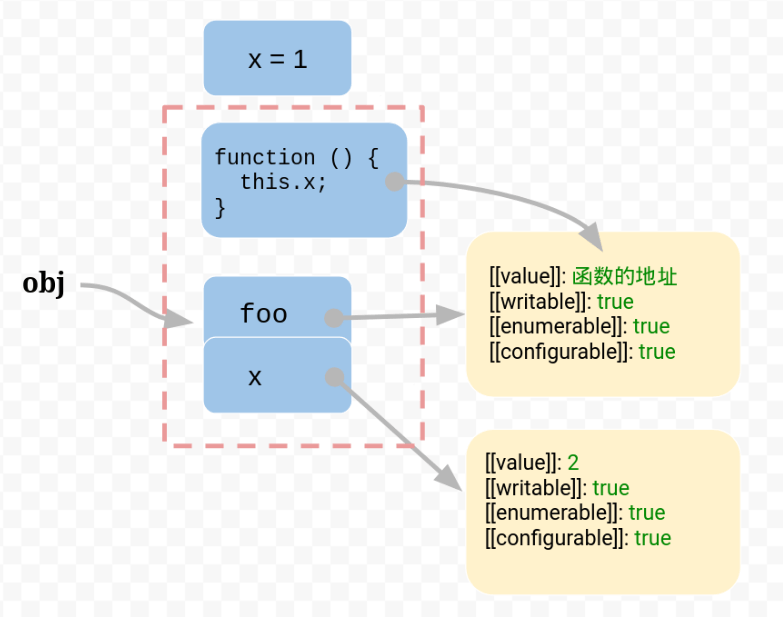

# javascript的this原理

## 问题的由来

```js
var obj = {
  foo:function(){}
};
var foo = obj.foo;
//写法一
obj.foo()
//写法二
foo();
```

上面代码中，虽然ob j.foo和foo指向同一个函数，但是执行结果可能不一样，看下面的例子

```js
var obj = {
  foo:funciton(){console.log(this.bar)},
  bar:1
};
var foo = obj.foo;
var bar = 2;
obj.foo() //1
foo() //2
```

这种差异的原因，就在于函数体内部使用了this关键字，this指的是函数运行时所在的环境，对于obj.foo()来说，foo运行在obj环境，所以this指向foo()来说，foo运行在全局环境，所以this指向全局环境，所以，两者的运行结果不一样，这个解释是没错的，但是为什么会这样，函数的运行环境到底是怎么样决定的，举例来说，为什么obj.foo()就是在obj环境执行，而一旦`var foo =obj.foo`,foo()就变成在全局环境下执行？

## 内存的数据结构

JavaScript语言之所以有this的设计，跟内存里面的数据结构有关系。

`var obj = {foo:5}`

上面的代码将一个对象赋值给变量obj，JavaScript引擎会在内存里面，生成一个对象`{foo:5}`，然后把这个对象的内存地址赋值给变量obj


也就是说，变量obj是一个地址，后面如果要读取obj.foo，引擎先从obj拿到内存地址，然后再从该地址读出原始的对象，返回它的foo属性。

原始的对象以字典结构保存，每一个属性名都对应一个属性描述符，举例来说，上面例子的foo属性，实际上是以下面的形式保存的。


注意：foo属性的值保存在属性描述对象的value属性里面。

## 函数

这样的结构很清晰，问题在于属性的值可能是一个函数

`var obj = {foo:function(){}}`

这时，引擎会将函数单独保存在内存中，然后再将函数的地址赋值给foo属性的value属性


由于函数是一个单独的值，所以它可以在不同的环境（上下文）执行

```js
var f = function(){}
var obj = {f:f};
//单独执行
f()
//obj环境执行
obj.f()
```

## 环境变量

JavaScript允许在函数体内部，引用当前环境的其他变量

```js
var f = function () {
  console.log(x);
}
```

上面代码中，函数题里面使用了变量x，该变量由运行环境提供，现在问题就来了，由于函数可以在不同的运行环境执行，所以需要有一种机制，能够在函数体内部获得当前的运行环境（context），所以，this就出现了，它的设计目的就是在函数体内部，指代函数当前的运行环境

```js
var f = function () {
  console.log(this.x)
}
```

上述代码中，函数体里面this.x就是指当前运行环境的x。

```js
var f = function () {
  console.log(this.x)
}
var x = 1;
var obj = {
  f:f,
  x:2
};
//单独执行
fn() //1
//obj环境执行
obj.f() //2
```

上面代码中，函数f在全局环境执行，this.x指向全局环境的x。


在obj环境执行，this.x指向obj.x



回到本文开头提出的问题。obj.foo()是通过obj找到foo，所以就是在obj环境执行，一旦`var foo = obj.foo`，变量foo就直接指向函数本身，所以foo()就变成全局环境执行。