# 前端高质量知识

[toc]

## JS内存空间详细讲解


变量对象与堆内存

```js
var a = 20;
var b = 'abc';
var c = true;
var d = {m:20};
```

因为JavaScript具有自动垃圾回收机制，所以对于前端开发来说，内存空间并不是一个经常被提及的概念，很容易被大家忽视。特别是很多不是计算机专业的朋友在进入到前端之后，会对内存空间的认知比较模糊，甚至有些人干脆就是一无所知。

当然也包括我自己。在很长一段时间里认为内存空间的概念在JS的学习中并不是那么重要。可是后我当我回过头来重新整理JS基础时，发现由于对它们的模糊认知，导致了很多东西我都理解得并不明白。比如最基本的引用数据类型和引用传递到底是怎么回事儿？比如浅复制与深复制有什么不同？还有闭包，原型等等。

因此后来我才渐渐明白，想要对JS的理解更加深刻，就必须对内存空间有一个清晰的认知。

### 栈和堆

与C/C++不同，JavaScript中并没有严格意义上区分栈内存与堆内存。因此我们可以粗浅的理解为JavaScript的所有数据都保存在堆内存中。但是在某些场景，我们仍然需要基于堆栈数据结构的思路进行处理，比如JavaScript的执行上下文（关于执行上下文我会在下一篇文章中总结）。执行上下文在逻辑上实现了堆栈。因此理解堆栈数据结构的原理与特点任然十分重要。

要简单理解栈的存取方式，我们可以通过类比乒乓球盒子来分析。如下图左侧。

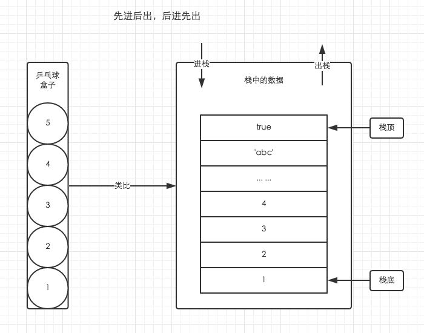

乒乓球盒子与栈类比

这种乒乓球的存放方式与栈中存取数据的方式如出一辙。处于盒子中最顶层的乒乓球5，它一定是最后被放进去，但可以最先被使用。而我们想要使用底层的乒乓球1，就必须将上面的4个乒乓球取出来，让乒乓球1处于盒子顶层。这就是栈空间先进后出，后进先出的特点。图中已经详细的表明了栈空间的存储原理。

堆存取数据的方式，则与书架与书非常相似。

书虽然也整齐的存放在书架上，但是我们只要知道书的名字，我们就可以很方便的取出我们想要的书，而不用像从乒乓球盒子里取乒乓一样，非得将上面的所有乒乓球拿出来才能取到中间的某一个乒乓球。好比在JSON格式的数据中，我们存储的`key-value`是可以无序的，因为顺序的不同并不影响我们的使用，我们只需要关心书的名字。

### 变量对象与基础数据类型

JavaScript的执行上下文生成之后，会创建一个叫做变量对象的特殊对象（具体会在下一篇文章与执行上下文一起总结），JavaScript的基础数据类型往往都会保存在变量对象中。

> 严格意义上来说，变量对象也是存放于堆内存中，但是由于变量对象的特殊职能，我们在理解时仍然需要将其于堆内存区分开来。

基础数据类型都是一些简单的数据段，JavaScript中有6种基础数据类型，分别是`Undefined、Null、Boolean、Number、String、Symbol`。基础数据类型都是按值访问，因为我们可以直接操作保存在变量中的实际的值。

### 引用数据类型与堆内存

与其他语言不通，JS的引用数据类型，比如数组Array，它们值的大小是不固定的。引用数据类型的值是保存在堆内存中的对象。JavaScript不允许直接访问堆内存中的位置，因此我们不能直接操作对象的堆内存空间。在操作对象时，实际上是在操作对象的引用而不是实际的对象。因此，引用类型的值都是按引用访问的。这里的引用，我们可以粗浅地理解为保存在变量对象中的一个地址，该地址与堆内存的实际值相关联。

为了更好的搞懂变量对象与堆内存，我们可以结合以下例子与图解进行理解。

```js
var a1 = 0; // 变量对象
 
var a2 = 'this is string'; // 变量对象
 
var a3 = null; // 变量对象
 
var b = { m: 20 }; // 变量b存在于变量对象中，{m: 20} 作为对象存在于堆内存中
 
var c = [1, 2, 3]; // 变量c存在于变量对象中，[1, 2, 3] 作为对象存在于堆内存中
```

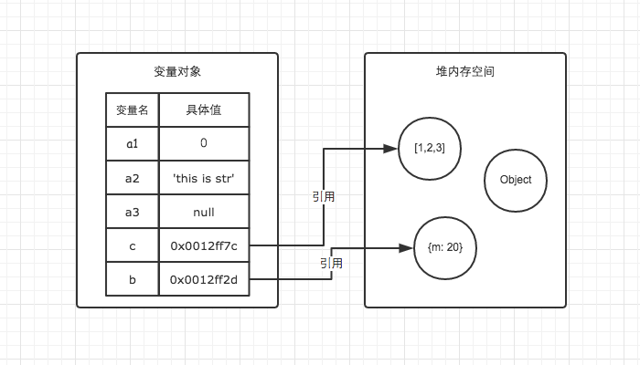

上例图解

因此当我们要访问堆内存中的引用数据类型时，实际上我们首先是从变量对象中获取了该对象的地址引用（或者地址指针），然后再从堆内存中取得我们需要的数据。

理解了JS的内存空间，我们就可以借助内存空间的特性来验证一下引用类型的一些特点了。

在前端面试中我们常常会遇到这样一个类似的题目

```js
// demo01.js
var a = 20;
var b = a;
b = 30;
// 这时a的值是多少？
// demo02.js
var m = { a: 10, b: 20 }
var n = m;
n.a = 15; 
// 这时m.a的值是多少
```

在变量对象中的数据发生复制行为时，系统会自动为新的变量分配一个新值。`var b = a`执行之后，a与b虽然值都等于20，但是他们其实已经是相互独立互不影响的值了。具体如图。所以我们修改了b的值以后，a的值并不会发生变化。

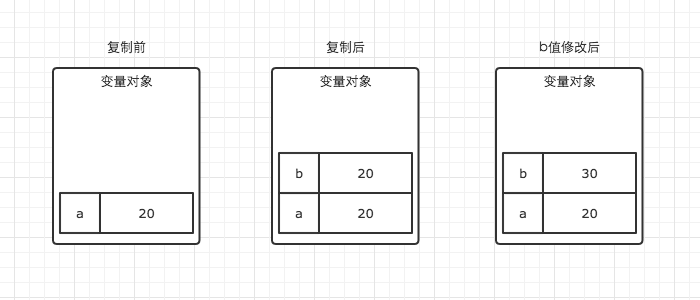

在demo02中，我们通过`var n = m`执行一次复制引用类型的操作。引用类型的复制同样也会为新的变量自动分配一个新的值保存在变量对象中，但不同的是，这个新的值，仅仅只是引用类型的一个地址指针。当地址指针相同时，尽管他们相互独立，但是在变量对象中访问到的具体对象实际上是同一个。如图所示。

因此当我改变n时，m也发生了变化。这就是引用类型的特性。

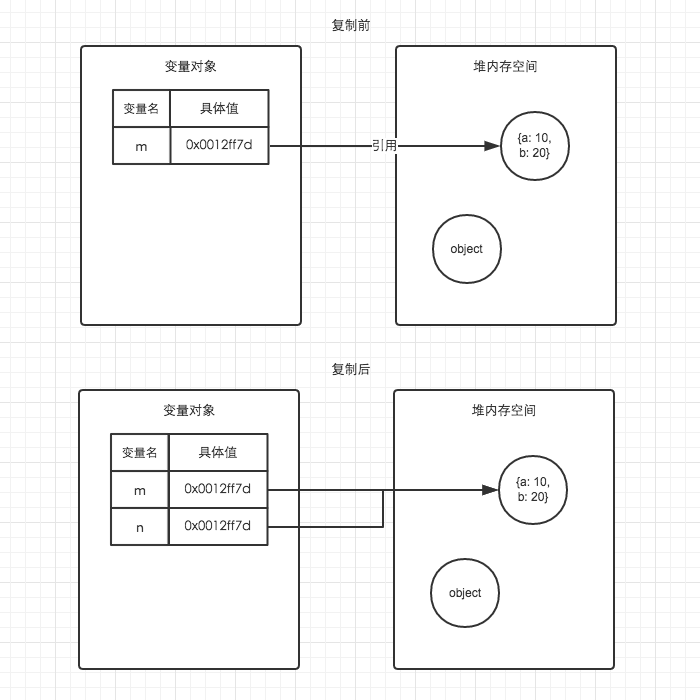

通过内存的角度来理解，是不是感觉要轻松很多。除此之外，我们还可以以此为基础，一步一步的理解JavaScript的执行上下文，作用域链，闭包，原型链等重要概念。其他的我会在以后的文章慢慢总结，敬请期待。

### 内存空间管理

因为JavaScript具有自动垃圾收集机制，所以我们在开发时好像不用关心内存的使用问题，内存的分配与回收都完全实现了自动管理。但是根据我自己的开发经验，了解内存机制有助于自己清晰的认识到自己写的代码在执行过程中发生过什么，从而写出性能更加优秀的代码。因此关心内存是一件非常重要的事情。

JavaScript的内存生命周期

1. 分配你所需要的内存
2. 使用分配到的内存（读、写）
3. 不需要时将其释放、归还

为了便于理解，我们使用一个简单的例子来解释这个周期。

```js
var a = 20; // 在内存中给数值变量分配空间
alert(a + 100); // 使用内存
var a = null; // 使用完毕之后，释放内存空间
```

第一步和第二步我们都很好理解，JavaScript在定义变量时就完成了内存分配。第三步释放内存空间则是我们需要重点理解的一个点。

JavaScript有自动垃圾收集机制，那么这个自动垃圾收集机制的原理是什么呢？其实很简单，就是找出那些不再继续使用的值，然后释放其占用的内存。垃圾收集器会每隔固定的时间段就执行一次释放操作。

在JavaScript中，最常用的是通过标记清除的算法来找到哪些对象是不再继续使用的，因此`a = null`其实仅仅只是做了一个释放引用的操作，让 a 原本对应的值失去引用，脱离执行环境，这个值会在下一次垃圾收集器执行操作时被找到并释放。而在适当的时候解除引用，是为页面获得更好性能的一个重要方式。

> 在局部作用域中，当函数执行完毕，局部变量也就没有存在的必要了，因此垃圾收集器很容易做出判断并回收。但是全局变量什么时候需要自动释放内存空间则很难判断，因此在我们的开发中，需要尽量避免使用全局变量，以确保性能问题。

## JS执行上下文(执行环境)详细图解Script

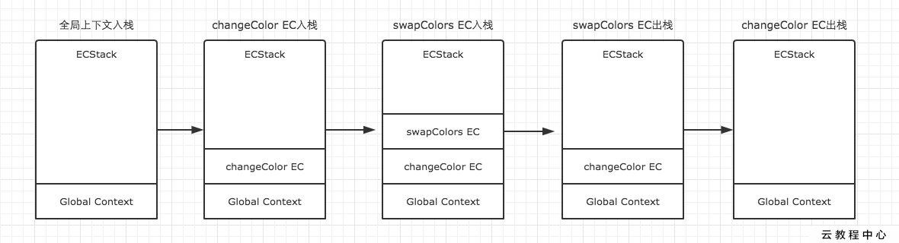

我们在JS学习初期或者面试的时候常常会遇到考核变量提升的思考题。比如先来一个简单一点的。

```js
console.log(a);   // 这里会打印出什么？
var a = 20;
```

变量提升:即将变量声明提升到它所在作用域的最开始的部分

函数提升:js中创建函数有两种方式：函数声明式和函数字面量式。只有函数声明才存在函数提升

暂时先不管这个例子,我们先引入一个JavaScript中最基础,但同时也是最重要的一个概念执行上下文(Execution Context)。

每次当控制器转到可执行代码的时候,就会进入一个执行上下文。执行上下文可以理解为当前代码的执行环境,它会形成一个作用域。JavaScript中的运行环境大概包括三种情况。

- 全局环境:JavaScript代码运行起来会首先进入该环境
- 函数环境:当函数被调用执行时,会进入当前函数中执行代码
- eval

因此在一个JavaScript程序中,必定会产生多个执行上下文,在我的上一篇文章中也有提到,JavaScript引擎会以堆栈的方式来处理它们。栈底永远都是全局上下文,而栈顶就是当前正在执行的上下文。

当代码在执行过程中,遇到以上三种情况,都会生成一个执行上下文,放入栈中,而处于栈顶的上下文执行完毕之后,就会自动出栈。为了更加清晰的理解这个过程,根据下面的例子,结合图示给大家展示。

```js
var color = 'blue';
  
function changeColor() {
    var anotherColor = 'red';
  
    function swapColors() {
        var tempColor = anotherColor;
        anotherColor = color;
        color = tempColor;
    }
  
    swapColors();
}
  
changeColor();
```

我们用ECStock来表示处理执行上下文组的堆栈。我们很容易知道,第一步,首先是全局上下文入栈。

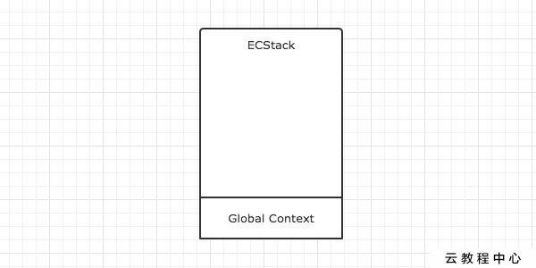

全局上下文入栈之后,其中的可执行代码开始执行,直到遇到了changeColor(),这一句激活函数changeColor创建它自己的执行上下文,因此第二步就是changeColor的执行上下文入栈。

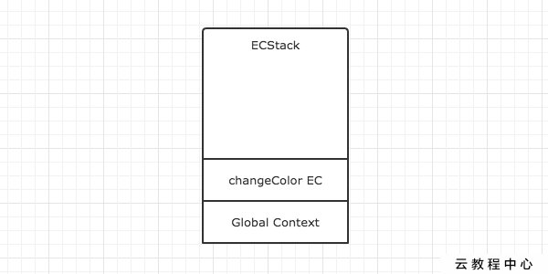

changeColor的上下文入栈之后,控制器开始执行其中的可执行代码,遇到swapColors()之后又激活了一个执行上下文。因此第三步是swapColors的执行上下文入栈。

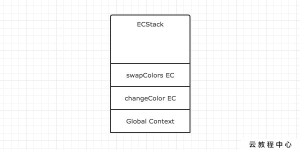

在swapColors的可执行代码中,再没有遇到其他能生成执行上下文的情况,因此这段代码顺利执行完毕,swapColors的上下文从栈中弹出。


swapColors的执行上下文弹出之后,继续执行changeColor的可执行代码,也没有再遇到其他执行上下文,顺利执行完毕之后弹出。这样,ECStack中就只身下全局上下文了。


全局上下文在浏览器窗口关闭后出栈。

> 注意:函数中,遇到return能直接终止可执行代码的执行,因此会直接将当前上下文弹出栈。

整个过程

详细了解了这个过程之后,我们就可以对执行上下文总结一些结论了。

- 单线程
- 同步执行,只有栈顶的上下文处于执行中,其他上下文需要等待
- 全局上下文只有唯一的一个,它在浏览器关闭时出栈
- 函数的执行上下文的个数没有限制
- 每次某个函数被调用,就会有个新的执行上下文为其创建,即使是调用的自身函数,也是如此。

为了巩固一下执行上下文的理解,我们再来绘制一个例子的演变过程,这是一个简单的闭包例子。

```js
function f1(){
    var n=999;
    function f2(){
        alert(n);
    }
    return f2;
}
var result=f1();
result(); // 999
```

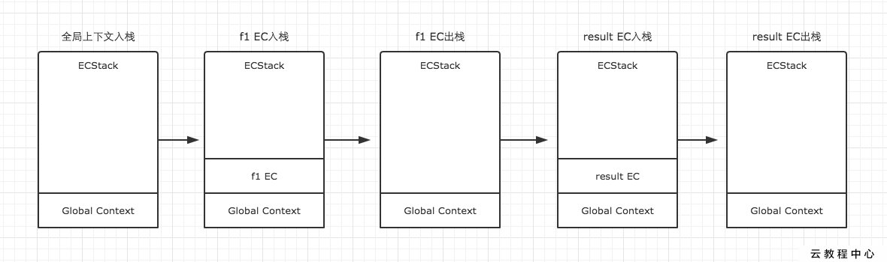

## JS变量对象详解

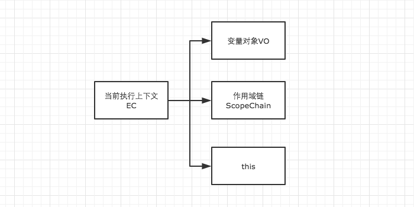

在JavaScript中，我们肯定不可避免的需要声明变量和函数，可是JS解析器是如何找到这些变量的呢？我们还得对执行上下文有一个进一步的了解。

在上一篇文章中，我们已经知道，当调用一个函数时（激活），一个新的执行上下文就会被创建。而一个执行上下文的生命周期可以分为两个阶段。

- 创建阶段
  在这个阶段中，执行上下文会分别创建变量对象，建立作用域链，以及确定this的指向
- 代码执行阶段
  创建完成之后，就会开始执行代码，这个时候，会完成变量赋值，函数引用，以及执行其他代码。

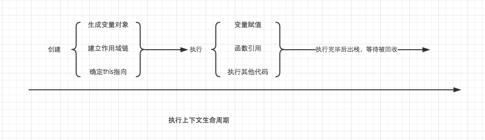

执行上下文生命周期

从这里我们就可以看出详细了解执行上下文极为重要，因为其中涉及到了变量对象，作用域链，this等很多人没有怎么弄明白，但是却极为重要的概念，因此它关系到我们能不能真正理解JavaScript。在后面的文章中我们会一一详细总结，这里我们先重点了解变量对象。

### 变量对象（Variable Object）

变量对象的创建，依次经历了以下几个过程。

1. 建立arguments对象。检查当前上下文中的参数，建立该对象下的属性与属性值。
2. 检查当前上下文的函数声明，也就是使用function关键字声明的函数。在变量对象中以函数名建立一个属性，属性值为指向该函数所在内存地址的引用。如果函数名的属性已经存在，那么该属性将会被新的引用所覆盖。
3. 检查当前上下文中的变量声明，每找到一个变量声明，就在变量对象中以变量名建立一个属性，属性值为undefined。如果该变量名的属性已经存在，为了防止同名的函数被修改为undefined，则会直接跳过，原属性值不会被修改。


根据这个规则，理解变量提升就变得十分简单了。在很多文章中虽然提到了变量提升，但是具体是怎么回事还真的很多人都说不出来，以后在面试中用变量对象的创建过程跟面试官解释变量提升，保证瞬间提升逼格。

在上面的规则中我们看出，function声明会比var声明优先级更高一点。为了帮助大家更好的理解变量对象，我们结合一些简单的例子来进行探讨。

```js
// demo01
function test() {
    console.log(a);
    console.log(foo());
  
    var a = 1;
    function foo() {
        return 2;
    }
}
test();
```

在上例中，我们直接从test()的执行上下文开始理解。全局作用域中运行`test()`时，test()的执行上下文开始创建。为了便于理解，我们用如下的形式来表示

```js
// 创建过程
testEC = {
    // 变量对象
    VO: {},
    scopeChain: {},
    this: {}
}
// 因为本文暂时不详细解释作用域链和this，所以把变量对象专门提出来说明 
// VO 为 Variable Object的缩写，即变量对象
VO = {
    arguments: {...},  //注：在浏览器的展示中，函数的参数可能并不是放在arguments对象中，这里为了方便理解，我做了这样的处理
    foo: <foo reference>  // 表示foo的地址引用
    a: undefined
}
```

未进入执行阶段之前，变量对象中的属性都不能访问！但是进入执行阶段之后，变量对象转变为了活动对象，里面的属性都能被访问了，然后开始进行执行阶段的操作。

这样，如果再面试的时候被问到变量对象和活动对象有什么区别，就又可以自如的应答了，他们其实都是同一个对象，只是处于执行上下文的不同生命周期。

```js
// 执行阶段
VO ->  AO   // Active Object
AO = {
    arguments: {...},
    foo: <foo reference>,
    a: 1
}
```

因此，上面的例子demo1，执行顺序就变成了这样

```js
function test() {
    function foo() {
        return 2;
    }
    var a;
    console.log(a);
    console.log(foo());
    a = 1;
}
test();
```

再来一个例子，巩固一下我们的理解。

```js
// demo2
function test() {
    console.log(foo);
    console.log(bar);
  
    var foo = 'Hello';
    console.log(foo);
    var bar = function () {
        return 'world';
    }
  
    function foo() {
        return 'hello';
    }
}
test();
```

```js
// 创建阶段
VO = {
    arguments: {...},
    foo: <foo reference>,
    bar: undefined
}
// 这里有一个需要注意的地方，因为var声明的变量当遇到同名的属性时，会跳过而不会覆盖
```

```js
// 执行阶段
VO -> AO
VO = {
    arguments: {...},
    foo: 'Hello',
    bar: <bar reference>
}
```

需要结合上面的知识，仔细对比这个例子中变量对象从创建阶段到执行阶段的变化，如果你已经理解了，说明变量对象相关的东西都已经难不倒你了。

### 全局上下文的变量对象

以浏览器中为例，全局对象为window。
全局上下文有一个特殊的地方，它的变量对象，就是window对象。而这个特殊，在this指向上也同样适用，this也是指向window。

```js
// 以浏览器中为例，全局对象为window
// 全局上下文
windowEC = {
    VO: window,
    scopeChain: {},
    this: window
}
```

除此之外，全局上下文的生命周期，与程序的生命周期一致，只要程序运行不结束，比如关掉浏览器窗口，全局上下文就会一直存在。其他所有的上下文环境，都能直接访问全局上下文的属性。

## JS详细图解作用域链与闭包

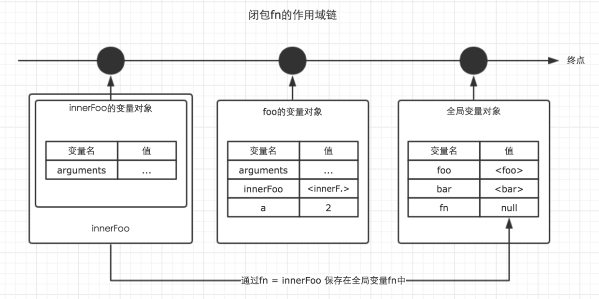

初学JavaScript的时候，我在学习闭包上，走了很多弯路。而这次重新回过头来对基础知识进行梳理，要讲清楚闭包，也是一个非常大的挑战。

闭包有多重要？如果你是初入前端的朋友，我没有办法直观的告诉你闭包在实际开发中的无处不在，但是我可以告诉你，前端面试，必问闭包。面试官们常常用对闭包的了解程度来判定面试者的基础水平，保守估计，10个前端面试者，至少5个都死在闭包上。

可是为什么，闭包如此重要，还是有那么多人没有搞清楚呢？是因为大家不愿意学习吗？还真不是，而是我们通过搜索找到的大部分讲解闭包的中文文章，都没有清晰明了的把闭包讲解清楚。要么浅尝辄止，要么高深莫测，要么干脆就直接乱说一通。包括我自己曾经也写过一篇关于闭包的总结，回头一看，不忍直视[捂脸]。

因此本文的目的就在于，能够清晰明了得把闭包说清楚，让读者老爷们看了之后，就把闭包给彻底学会了，而不是似懂非懂。

### 作用域与作用域链

在详细讲解作用域链之前，我默认你已经大概明白了JavaScript中的下面这些重要概念。这些概念将会非常有帮助。

- 基础数据类型与引用数据类型
- 内存空间
- 垃圾回收机制
- 执行上下文
- 变量对象与活动对象

#### 作用域

- 在JavaScript中，我们可以将作用域定义为一套规则,这套规则用来管理引擎如何在当前作用域以及嵌套的子作用域中根据标识符名称进行变量查找。

  > 这里的标识符，指的是变量名或者函数名

- JavaScript中只有全局作用域与函数作用域(因为eval我们平时开发中几乎不会用到它，这里不讨论)。

- 作用域与执行上下文是完全不同的两个概念。我知道很多人会混淆他们，但是一定要仔细区分。

  > JavaScript代码的整个执行过程，分为两个阶段，代码编译阶段与代码执行阶段。编译阶段由编译器完成，将代码翻译成可执行代码，这个阶段作用域规则会确定。执行阶段由引擎完成，主要任务是执行可执行代码，执行上下文在这个阶段创建。

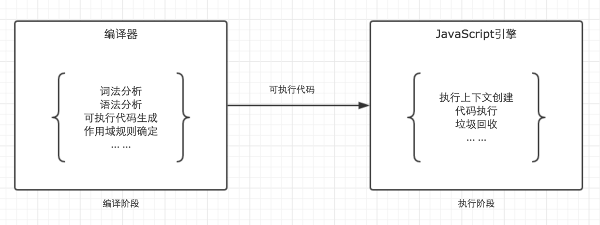

#### 作用域链

回顾一下上一篇文章我们分析的执行上下文的生命周期，如下图。


我们发现，作用域链是在执行上下文的创建阶段生成的。这个就奇怪了。上面我们刚刚说作用域在编译阶段确定规则，可是为什么作用域链却在执行阶段确定呢？

之所有有这个疑问，是因为大家对作用域和作用域链有一个误解。我们上面说了，作用域是一套规则，那么作用域链是什么呢？是这套规则的具体实现。所以这就是作用域与作用域链的关系，相信大家都应该明白了吧。

我们知道函数在调用激活时，会开始创建对应的执行上下文，在执行上下文生成的过程中，变量对象，作用域链，以及this的值会分别被确定。之前一篇文章我们详细说明了变量对象，而这里，我们将详细说明作用域链。

作用域链，是由当前环境与上层环境的一系列变量对象组成，它保证了当前执行环境对符合访问权限的变量和函数的有序访问。

为了帮助大家理解作用域链，我我们先结合一个例子，以及相应的图示来说明。

```js
var a = 20; 
function test() {
    var b = a + 10;
  
    function innerTest() {
        var c = 10;
        return b + c;
    }
  
    return innerTest();
}
test();
```

在上面的例子中，全局，函数test，函数innerTest的执行上下文先后创建。我们设定他们的变量对象分别为VO(global)，VO(test), VO(innerTest)。而innerTest的作用域链，则同时包含了这三个变量对象，所以innerTest的执行上下文可如下表示。

```js
innerTestEC = {
    VO: {...},  // 变量对象
    scopeChain: [VO(innerTest), VO(test), VO(global)], // 作用域链
    this: {}
}
```

是的，你没有看错，我们可以直接用一个数组来表示作用域链，数组的第一项scopeChain[0]为作用域链的最前端，而数组的最后一项，为作用域链的最末端，所有的最末端都为全局变量对象。

很多人会误解为当前作用域与上层作用域为包含关系，但其实并不是。以最前端为起点，最末端为终点的单方向通道我认为是更加贴切的形容。如图。

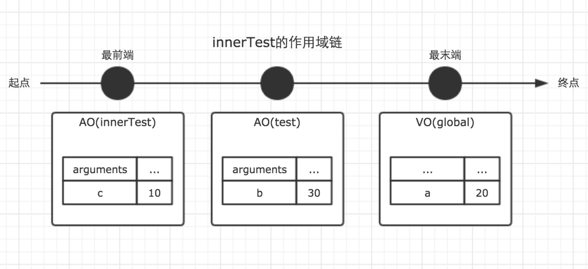

> 注意，因为变量对象在执行上下文进入执行阶段时，就变成了活动对象，这一点在上一篇文章中已经讲过，因此图中使用了AO来表示。Active Object

是的，作用域链是由一系列变量对象组成，我们可以在这个单向通道中，查询变量对象中的标识符，这样就可以访问到上一层作用域中的变量了。

### 闭包

对于那些有一点 JavaScript 使用经验但从未真正理解闭包概念的人来说，理解闭包可以看作是某种意义上的重生，突破闭包的瓶颈可以使你功力大增。

- 闭包与作用域链息息相关；
- 闭包是在函数执行过程中被确认。

先直截了当的抛出闭包的定义：当函数可以记住并访问所在的作用域(全局作用域除外)时，就产生了闭包，即使函数是在当前作用域之外执行。

> 简单来说，假设函数A在函数B的内部进行定义了，并且当函数A在执行时，访问了函数B内部的变量对象，那么B就是一个闭包。

JavaScript拥有自动的垃圾回收机制，关于垃圾回收机制，有一个重要的行为，那就是，当一个值，在内存中失去引用时，垃圾回收机制会根据特殊的算法找到它，并将其回收，释放内存。

而我们知道，函数的执行上下文，在执行完毕之后，生命周期结束，那么该函数的执行上下文就会失去引用。其占用的内存空间很快就会被垃圾回收器释放。可是闭包的存在，会阻止这一过程。

先来一个简单的例子。

```js
var fn = null;
function foo() {
    var a = 2;
    function innnerFoo() {
        console.log(a);
    }
    fn = innnerFoo; // 将 innnerFoo的引用，赋值给全局变量中的fn
}
  
function bar() {
    fn(); // 此处的保留的innerFoo的引用
}
foo();
bar(); // 2
```

在上面的例子中，`foo()`执行完毕之后，按照常理，其执行环境生命周期会结束，所占内存被垃圾收集器释放。但是通过`fn = innerFoo`，函数innerFoo的引用被保留了下来，复制给了全局变量fn。这个行为，导致了foo的变量对象，也被保留了下来。于是，函数fn在函数bar内部执行时，依然可以访问这个被保留下来的变量对象。所以此刻仍然能够访问到变量a的值。

这样，我们就可以称foo为闭包。

下图展示了闭包fn的作用域链。


我们可以在chrome浏览器的开发者工具中查看这段代码运行时产生的函数调用栈与作用域链的生成情况。如下图。

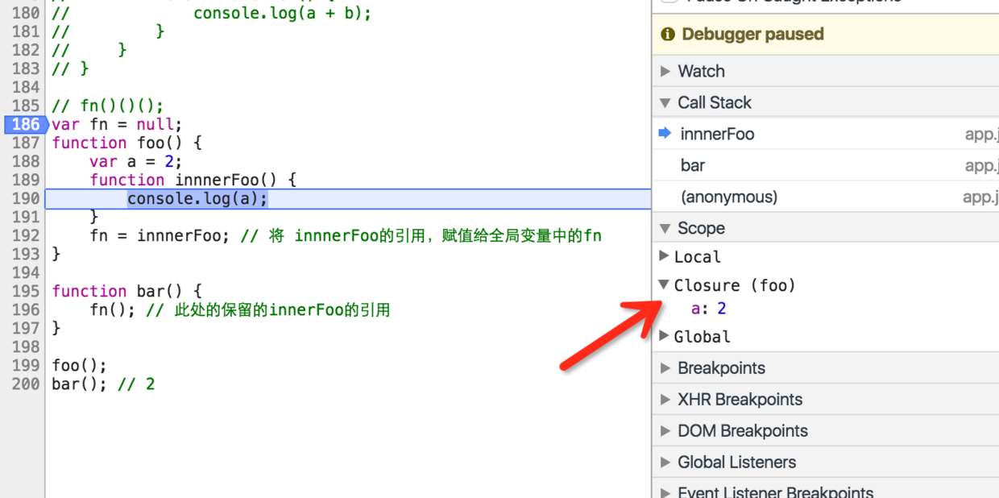

从图中可以看出，chrome浏览器认为闭包是foo，而不是通常我们认为的innerFoo

在上面的图中，红色箭头所指的正是闭包。其中Call Stack为当前的函数调用栈，Scope为当前正在被执行的函数的作用域链，Local为当前的局部变量。

所以，通过闭包，我们可以在其他的执行上下文中，访问到函数的内部变量。比如在上面的例子中，我们在函数bar的执行环境中访问到了函数foo的a变量。个人认为，从应用层面，这是闭包最重要的特性。利用这个特性，我们可以实现很多有意思的东西。

不过读者老爷们需要注意的是，虽然例子中的闭包被保存在了全局变量中，但是闭包的作用域链并不会发生任何改变。在闭包中，能访问到的变量，仍然是作用域链上能够查询到的变量。

对上面的例子稍作修改，如果我们在函数bar中声明一个变量c，并在闭包fn中试图访问该变量，运行结果会抛出错误。

```js
var fn = null;
function foo() {
    var a = 2;
    function innnerFoo() {
        console.log(c); // 在这里，试图访问函数bar中的c变量，会抛出错误
        console.log(a);
    }
    fn = innnerFoo; // 将 innnerFoo的引用，赋值给全局变量中的fn
} 
function bar() {
    var c = 100;
    fn(); // 此处的保留的innerFoo的引用
}
foo();
bar();
```

闭包的应用场景

接下来，我们来总结下，闭包的常用场景。

- 延迟函数setTimeout

我们知道setTimeout的第一个参数是一个函数，第二个参数则是延迟的时间。在下面例子中，

````js
function fn() {
    console.log('this is test.')
}
var timer =  setTimeout(fn, 1000);
console.log(timer);
````

执行上面的代码，变量timer的值，会立即输出出来，表示setTimeout这个函数本身已经执行完毕了。但是一秒钟之后，fn才会被执行。这是为什么？

按道理来说，既然fn被作为参数传入了setTimeout中，那么fn将会被保存在setTimeout变量对象中，setTimeout执行完毕之后，它的变量对象也就不存在了。可是事实上并不是这样。至少在这一秒钟的事件里，它仍然是存在的。这正是因为闭包。

很显然，这是在函数的内部实现中，setTimeout通过特殊的方式，保留了fn的引用，让setTimeout的变量对象，并没有在其执行完毕后被垃圾收集器回收。因此setTimeout执行结束后一秒，我们任然能够执行fn函数。

- 柯里化

在函数式编程中，利用闭包能够实现很多炫酷的功能，柯里化算是其中一种。关于柯里化，我会在以后详解函数式编程的时候仔细总结。

- 模块

在我看来，模块是闭包最强大的一个应用场景。如果你是初学者，对于模块的了解可以暂时不用放在心上，因为理解模块需要更多的基础知识。但是如果你已经有了很多JavaScript的使用经验，在彻底了解了闭包之后，不妨借助本文介绍的作用域链与闭包的思路，重新理一理关于模块的知识。这对于我们理解各种各样的设计模式具有莫大的帮助。

```js
(function () {
    var a = 10;
    var b = 20;
  
    function add(num1, num2) {
        var num1 = !!num1 ? num1 : a;
        var num2 = !!num2 ? num2 : b;
  
        return num1 + num2;
    }
  
    window.add = add;
})();
add(10, 20);
```

在上面的例子中，我使用函数自执行的方式，创建了一个模块。方法add被作为一个闭包，对外暴露了一个公共方法。而变量a，b被作为私有变量。在面向对象的开发中，我们常常需要考虑是将变量作为私有变量，还是放在构造函数中的this中，因此理解闭包，以及原型链是一个非常重要的事情。模块十分重要，因此我会在以后的文章专门介绍，这里就暂时不多说啦。

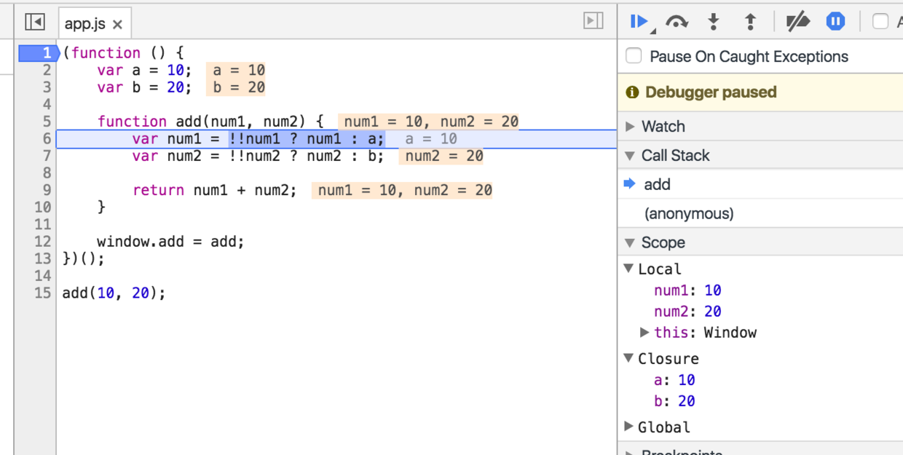

此图中可以观看到当代码执行到add方法时的调用栈与作用域链，此刻的闭包为外层的自执行函数

为了验证自己有没有搞懂作用域链与闭包，这里留下一个经典的思考题，常常也会在面试中被问到。

利用闭包，修改下面的代码，让循环输出的结果依次为1， 2， 3， 4， 5

```js
for (var i=1; i<=5; i++) {
    setTimeout( function timer() {
        console.log(i);
    }, i*1000 );
}
```

```js
function add(){
    var i=0;
    return function(){
        i++;
        console.log(i);
    }
}
var result=add();
for(var i=0;i<5;i++){
    setTimeout(function(){result();},i*1000);
}
```

## JS详细图解全方位解读this

在这之前，我们需要来回顾一下执行上下文。

在前面几篇文章中，我有好几个地方都提到执行上下文的生命周期，为了防止大家没有记住，再次来回顾一下，如下图。


在执行上下文的创建阶段，会分别生成变量对象，建立作用域链，确定this指向。其中变量对象与作用域链我们都已经仔细总结过了，而这里的关键，就是确定this指向。

在这里，我们需要得出一个非常重要一定要牢记于心的结论，this的指向，是在函数被调用的时候确定的。也就是执行上下文被创建时确定的。因此我们可以很容易就能理解到，一个函数中的this指向，可以是非常灵活的。比如下面的例子中，同一个函数由于调用方式的不同，this指向了不一样的对象。

```js
var a = 10;
var obj = {
    a: 20
}
function fn () {
    console.log(this.a);
}
fn(); // 10
fn.call(obj); // 20
```

> 每个函数都包含两个非继承而来的方法：call()方法和apply()方法。
> call()和apply()方法时，就会改变this的指向。

除此之外，在函数执行过程中，this一旦被确定，就不可更改了。

```js
var a = 10;
var obj = {
    a: 20
} 
function fn () {
    this = obj; // 这句话试图修改this，运行后会报错
    console.log(this.a);
}
fn();
```

### 全局对象中的this

关于全局对象的this，我之前在总结变量对象的时候提到过，它是一个比较特殊的存在。全局环境中的this，指向它本身。因此，这也相对简单，没有那么多复杂的情况需要考虑。

```js
// 通过this绑定到全局对象
this.a2 = 20; 
// 通过声明绑定到变量对象，但在全局环境中，变量对象就是它自身
var a1 = 10;  
// 仅仅只有赋值操作，标识符会隐式绑定到全局对象
a3 = 30;  
// 输出结果会全部符合预期
console.log(a1);
console.log(a2);
console.log(a3);
```

### 函数中的this

在总结函数中this指向之前，我想我们有必要通过一些奇怪的例子，来感受一下函数中this的捉摸不定。

```js
// demo01
var a = 20;
function fn() {
    console.log(this.a);
}
fn();
```

```js
// demo02
var a = 20;
function fn() {
    function foo() {
        console.log(this.a);
    }
    foo();
}
fn();
```

```js
// demo03
var a = 20;
var obj = {
    a: 10,
    c: this.a + 20,
    fn: function () {
        return this.a;
    }
}
console.log(obj.c);
console.log(obj.fn());
```

这几个例子需要读者老爷们花点时间稍微感受一下，如果你暂时没想明白怎么回事，也不用着急，我们一点一点来分析。

分析之前，我们先直接了当抛出结论。

在一个函数上下文中，this由调用者提供，由调用函数的方式来决定。如果调用者函数，被某一个对象所拥有，那么该函数在调用时，内部的this指向该对象。如果函数独立调用，那么该函数内部的this，则指向undefined。但是在非严格模式中，当this指向undefined时，它会被自动指向全局对象。

从结论中我们可以看出，想要准确确定this指向，找到函数的调用者以及区分他是否是独立调用就变得十分关键。

```js
// 为了能够准确判断，我们在函数内部使用严格模式，因为非严格模式会自动指向全局
function fn() {
    'use strict';
    console.log(this);
}
fn();  // fn是调用者，独立调用
window.fn();  // fn是调用者，被window所拥有
```

在上面的简单例子中，`fn()`作为独立调用者，按照定义的理解，它内部的this指向就为undefined。而`window.fn()`则因为fn被window所拥有，内部的this就指向了window对象。

那么掌握了这个规则，现在回过头去看看上面的三个例子，通过添加/去除严格模式，那么你就会发现，原来this已经变得不那么虚无缥缈，已经有迹可循了。

但是我们需要特别注意的是demo03。在demo03中，对象obj中的c属性使用`this.a + 20`来计算，而他的调用者`obj.c`并非是一个函数。因此他不适用于上面的规则，我们要对这种方式单独下一个结论。

当obj在全局声明时，无论`obj.c`在什么地方调用，这里的this都指向全局对象，而当obj在函数环境中声明时，这个this指向undefined，在非严格模式下，会自动转向全局对象。可运行下面的例子查看区别。

```js
'use strict';
var a = 20;
function foo () {
    var a = 1;
    var obj = {
        a: 10,
        c: this.a + 20,
        fn: function () {
            return this.a;
        }
    }
    return obj.c;
  
}
console.log(foo()); // 运行会报错
```

实际开发中，并不推荐这样使用this；

上面多次提到的严格模式，需要大家认真对待，因为在实际开发中，现在基本已经全部采用严格模式了，而最新的ES6，也是默认支持严格模式。

再来看一些容易理解错误的例子，加深一下对调用者与是否独立运行的理解。

```js
var a = 20;
var foo = {
    a: 10,
    getA: function () {
        return this.a;
    }
}
console.log(foo.getA()); // 10
  
var test = foo.getA;
console.log(test());  // 20
```

`foo.getA()`中，getA是调用者，他不是独立调用，被对象foo所拥有，因此它的this指向了foo。而`test()`作为调用者，尽管他与foo.getA的引用相同，但是它是独立调用的，因此this指向undefined，在非严格模式，自动转向全局window。

稍微修改一下代码，大家自行理解。

```js
var a = 20;
function getA() {
    return this.a;
}
var foo = {
    a: 10,
    getA: getA
}
console.log(foo.getA());  // 10
```

灵机一动，再来一个。如下例子。　　

```js
function foo() {
    console.log(this.a)
}
  
function active(fn) {
    fn(); // 真实调用者，为独立调用
}
  
var a = 20;
var obj = {
    a: 10,
    getA: foo
}
  
active(obj.getA);
```

### 使用call，apply显示指定this

JavaScript内部提供了一种机制，让我们可以自行手动设置this的指向。它们就是call与apply。所有的函数都具有这两个方法。它们除了参数略有不同，其功能完全一样。它们的第一个参数都为this将要指向的对象。

如下例子所示。fn并非属于对象obj的方法，但是通过call，我们将fn内部的this绑定为obj，因此就可以使用this.a访问obj的a属性了。这就是call/apply的用法。

```js
function fn() {
    console.log(this.a);
}
var obj = {
    a: 20
}
  
fn.call(obj);
```

而call与applay后面的参数，都是向将要执行的函数传递参数。其中call以一个一个的形式传递，apply以数组的形式传递。这是他们唯一的不同。

```js
function fn(num1, num2) {
    console.log(this.a + num1 + num2);
}
var obj = {
    a: 20
}
  
fn.call(obj, 100, 10); // 130
fn.apply(obj, [20, 10]); // 50
```

因为call/apply的存在，这让JavaScript变得十分灵活。因此就让call/apply拥有了很多有用处的场景。简单总结几点，也欢迎大家补充。

1. 将类数组对象转换为数组

   ```js
   function exam(a, b, c, d, e) {
     
       // 先看看函数的自带属性 arguments 什么是样子的
       console.log(arguments);
     
       // 使用call/apply将arguments转换为数组, 返回结果为数组，arguments自身不会改变
       var arg = [].slice.call(arguments);
     
       console.log(arg);
   }
     
   exam(2, 8, 9, 10, 3);
     
   // result:
   // { '0': 2, '1': 8, '2': 9, '3': 10, '4': 3 }
   // [ 2, 8, 9, 10, 3 ]
   //
   // 也常常使用该方法将DOM中的nodelist转换为数组
   // [].slice.call( document.getElementsByTagName('li') );
   ```

2. 根据自己的需要灵活修改this指向

   ```js
   var foo = {
       name: 'joker',
       showName: function() {
         console.log(this.name);
       }
   }
   var bar = {
       name: 'rose'
   }
   foo.showName.call(bar);
   ```

3. 实现继承

   ```js
   // 定义父级的构造函数
   var Person = function(name, age) {
       this.name = name;
       this.age  = age;
       this.gender = ['man', 'woman'];
   }
     
   // 定义子类的构造函数
   var Student = function(name, age, high) {
     
       // use call
       Person.call(this, name, age);
       this.high = high;
   }
   Student.prototype.message = function() {
       console.log('name:'+this.name+', age:'+this.age+', high:'+this.high+', gender:'+this.gender[0]+';');
   }
     
   new Student('xiaom', 12, '150cm').message();
     
   // result
   // ----------
   // name:xiaom, age:12, high:150cm, gender:man;
   ```

简单给有面向对象基础的朋友解释一下。在Student的构造函数中，借助call方法，将父级的构造函数执行了一次，相当于将Person中的代码，在Sudent中复制了一份，其中的this指向为从Student中new出来的实例对象。call方法保证了this的指向正确，因此就相当于实现了基层。Student的构造函数等同于下。

```js
var Student = function(name, age, high) {
    this.name = name;
    this.age  = age;
    this.gender = ['man', 'woman'];
    // Person.call(this, name, age); 这一句话，相当于上面三句话，因此实现了继承
    this.high = high;
}
```

4. 在向其他执行上下文的传递中，确保this的指向保持不变

   如下面的例子中，我们期待的是getA被obj调用时，this指向obj，但是由于匿名函数的存在导致了this指向的丢失，在这个匿名函数中this指向了全局，因此我们需要想一些办法找回正确的this指向。

   ```js
   var obj = {
       a: 20,
       getA: function() {
           setTimeout(function() {
               console.log(this.a)
           }, 1000)
       }
   }
     
   obj.getA();
   ```

   常规的解决办法很简单，就是使用一个变量，将this的引用保存起来。我们常常会用到这方法，但是我们也要借助上面讲到过的知识，来判断this是否在传递中被修改了，如果没有被修改，就没有必要这样使用了。

   ```js
   var obj = {
       a: 20,
       getA: function() {
           var self = this;
           setTimeout(function() {
               console.log(self.a)
           }, 1000)
       }
   }
   ```

   另外就是借助闭包与apply方法，封装一个bind方法。

   ```js
   function bind(fn, obj) {
       return function() {
           return fn.apply(obj, arguments);
       }
   }
     
   var obj = {
       a: 20,
       getA: function() {
           setTimeout(bind(function() {
               console.log(this.a)
           }, this), 1000)
       }
   }
     
   obj.getA();
   ```

   当然，也可以使用ES5中已经自带的bind方法。它与我上面封装的bind方法是一样的效果。

   ```js
   var obj = {
       a: 20,
       getA: function() {
           setTimeout(function() {
               console.log(this.a)
           }.bind(this), 1000)
       }
   }
   ```

### 构造函数与原型方法上的this

在封装对象的时候，我们几乎都会用到this，但是，只有少数人搞明白了在这个过程中的this指向，就算我们理解了原型，也不一定理解了this。所以这一部分，我认为将会为这篇文章最重要最核心的部分。理解了这里，将会对你学习JS面向对象产生巨大的帮助。

结合下面的例子，我在例子抛出几个问题大家思考一下。

```js
function Person(name, age) {
  
    // 这里的this指向了谁?
    this.name = name;
    this.age = age;  
}
  
Person.prototype.getName = function() {
  
    // 这里的this又指向了谁？
    return this.name;
}
  
// 上面的2个this，是同一个吗，他们是否指向了原型对象？
  
var p1 = new Person('Nick', 20);
p1.getName();
```

我们已经知道，this，是在函数调用过程中确定，因此，搞明白new的过程中到底发生了什么就变得十分重要。

通过new操作符调用构造函数，会经历以下4个阶段。

- 创建一个新的对象；
- 将构造函数的this指向这个新对象；
- 指向构造函数的代码，为这个对象添加属性，方法等；
- 返回新对象。

因此，当new操作符调用构造函数时，this其实指向的是这个新创建的对象，最后又将新的对象返回出来，被实例对象p1接收。因此，我们可以说，这个时候，构造函数的this，指向了新的实例对象，p1。

而原型方法上的this就好理解多了，根据上边对函数中this的定义，`p1.getName()`中的getName为调用者，他被p1所拥有，因此getName中的this，也是指向了p1。