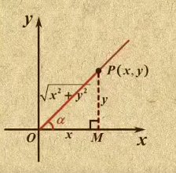

## 事件简介
`canvas`中的常见的事件共有3中：鼠标事件、键盘事件和循环事件。有了这些事件，就能开发出更有交互性的动画了。
### 鼠标事件
鼠标事件共有三种：
* 鼠标按下事件： `mousedown`
* 鼠标松开事件： `mouseup`
* 鼠标移动事件： `mousemove`

鼠标按下事件和松开事件是在鼠标按下和松开一瞬间触发的事件。鼠标移动事件能监控到鼠标在`canvas`中的移动路径，详情见例子`mouse.html`
我们操作的是流程一般由两种情况：
1. 点击效果：mousedown(按下) => mouseup(松开)
2. 移动拖动效果：mousedown(按下) => mousemove(移动) => mouseup(松开)

### 键盘事件
键盘事件共有两种：
* 键盘按下： keydown
* 键盘松开： keyup
键盘按下和松开都是在一瞬间触发的。但是需要注意的是`canvas`是不支持键盘事件的，需要结合window对象来实现键盘事件的监听。
```js
window.addEventListener(type, fn)
```
`type`表示监听事件的类型，如`keydown`、`keyup`；`fn`是事件处理函数。更多参数查看 [EventTarget.addEventListener()](https://developer.mozilla.org/zh-CN/docs/Web/API/EventTarget/addEventListener)

当然我们还需要注意按键的`keyCode`来判断用户按下的是哪个键，具体查看 [KeyboardEvent.keyCode](https://developer.mozilla.org/zh-CN/docs/Web/API/KeyboardEvent/keyCode)
|按键|keycode|
|---|---|
|W|87|
|A|65|
|S|83|
|D|68|
|↑|38|
|↓|40|
|←|37|
|→|39|
|空格|32|

### 循环事件
对于实现canvas动画我们一般都是定时器的方法来定时清空画布 => 重新绘图，从而实现动画效果。但是这种定时器的方式是不准确的，它无法精准的控制动画的帧率，这是js异步事件任务的问题，这里不详细说明。
所以，在canvas中我们通常使用`requestAnimationFrame()`方法来实现循环动画效果。它是无需手动设置间隔时间，它会根据浏览器绘制的帧率自动调整。
基本的原理就是：**使用`requestAnimationFrame()`方法不断地清除Canvas，然后重绘图形。**
## 物理动画
这里的物理动画通常如：烟花、雨滴、球体碰撞等。其实这些复杂的效果，需要我们掌握一些基本的数学和物理知识（高中），这些是canvas动画的核心，例如：
* 三角函数
* 匀速运动
* 加速运动
* 重力
* 摩擦力

当然，从之前的事件操作中学习到，canvas动画其实就是一个”清除、绘制、再清除、再绘制...“的过程。也就是两步：
1. 使用`clearRect()`方法清除整个canvas
2. 使用`requestAnimationFrame()`方法实现重新绘制
### 三角函数
三角函数是中学阶段接触的数学知识。它一般用于计算三角形中**未知长度的边**或者**未知度数的角**。



> $$
> 其中：R = \sqrt{x^2+y^2}
> 弧度 = 度数 * Math.PI/18
> $$
##### 正弦：
$$
sin α = \frac{y}{\sqrt{x^2+y^2}} = Math.sin(α * Math.PI / 180)
$$
##### 余弦：
$$
cos α = \frac{x}{\sqrt{x^2+y^2}} = Math.cos(α * Math.PI / 180)
$$ 
##### 正切：
$$
tan α = \frac{y}{x} = Math.tan(α * Math.PI / 180)
$$

##### 余割：
$$
csc α = \frac{\sqrt{x^2+y^2}}{y} = Math.asin(x / R) * (180 / Math.PI)
$$

##### 正割：
$$
sec α = \frac{\sqrt{x^2+y^2}}{x} = Math.acos(x / y) * (180 / Math.PI)
$$
##### 余切：
$$
cot α = \frac{x}{y} = Math.atan(x / y) * (180 / Math.PI)
$$

我们需要注意的是数学坐标系的y轴是正方向向上的，而canvas采用的是W3C坐标系，y轴是正方向向下的，换一种说法就是：数学坐标系可以理解为四象限中的第一象限，W3C坐标是四象限中的第二象限。
### 用途
1. 两点间的距离
2. 圆周运动
3. 波形运动