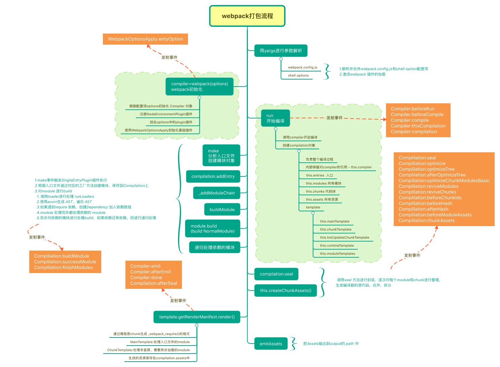

# Webpack原理



## 核心模块

```javascript
Entry: 指定webpack开始构建的入口模块，从该模块开始构建并计算出直接或间接依赖的模块或者库。
Output：告诉webpack如何命名输出的文件以及输出的目录
Module: 模块，在 Webpack 里一切皆模块，一个模块对应着一个文件。Webpack 会从配置的 Entry 开始递归找出所有依赖的模块。
Chunk：coding split的产物，我们可以对一些代码打包成一个单独的chunk，比如某些公共模块，去重，更好的利用缓存。或者按需加载某些功能模块，优化加载时间。在webpack3及以前我们都利用CommonsChunkPlugin将一些公共代码分割成一个chunk，实现单独加载。在webpack4 中CommonsChunkPlugin被废弃，使用SplitChunksPlugin
Loader：模块转换器，用于把模块原内容按照需求转换成新内容。
Plugin：扩展插件，在 Webpack 构建流程中的特定时机会广播出对应的事件，插件可以监听这些事件的发生，在特定时机做对应的事情。
```

## 打包流程

```javascript
Webpack 的运行流程是一个串行的过程，从启动到结束会依次执行以下流程：

初始化参数：从配置文件和 Shell 语句中读取与合并参数，得出最终的参数；
开始编译：用上一步得到的参数初始化 Compiler 对象，加载所有配置的插件，执行对象的 run 方法开始执行编译；
确定入口：根据配置中的 entry 找出所有的入口文件；
编译模块：从入口文件出发，调用所有配置的 Loader 对模块进行翻译，再找出该模块依赖的模块，再递归本步骤直到所有入口依赖的文件都经过了本步骤的处理；
完成模块编译：在经过第4步使用 Loader 翻译完所有模块后，得到了每个模块被翻译后的最终内容以及它们之间的依赖关系；
输出资源：根据入口和模块之间的依赖关系，组装成一个个包含多个模块的 Chunk，再把每个 Chunk 转换成一个单独的文件加入到输出列表，这步是可以修改输出内容的最后机会；
输出完成：在确定好输出内容后，根据配置确定输出的路径和文件名，把文件内容写入到文件系统。
```

## 编译结果

```javascript
(function(modules) {
  // 模拟 require 语句
  function __webpack_require__() {
  }
  // 执行存放所有模块数组中的第0个模块
  __webpack_require__(0);
})([/*存放所有模块的数组*/])

- 重写_webpack_require文件加载模式，模仿commonjs规范实现
- 将所有的js文件都已键值对的方式存入一个对象中，由_webpack_require来调用
```

#### Loader

loader是文件加载器，能够加载资源文件，并对这些文件进行一些处理，诸如编译、压缩等，最终一起打包到指定的文件中，处理一个文件可以使用多个loader，loader的执行顺序和配置中的顺序是相反的，即最后一个loader最先执行，第一个loader最后执行，第一个执行的loader接收源文件内容作为参数，其它loader接收前一个执行的loader的返回值作为参数，最后执行的loader会返回此模块的JavaScripf源码
编写自己的loader时需要引用官方提供的laoder-utils，调用`loaderUtils.getOptions(this)`拿到webpack的配置参数，然后进行自己的处理。
Loader 本身仅仅只是一个函数，接收模块代码的内容，然后返回代码内容转化后的结果，并且一个文件还可以链式的经过多 个loader转化(比如`scss-loader => css-loader：style-loade`r)。
一个 Loader 的职责是单一的，只需要完成一种转化。如果一个源文件需要经历多步转化才能正常使用，就通过多个 Loader 去转化。在调用多个 Loader 去转化一个文件时，
每个 Loader 会链式的顺序执行，第一个 Loader 将会拿到需处理的原内容，上一个 Loader 处理后的结果会传给下一个接着处理，最后的 Loader 将处理后的最终结果返回给Webpack。

**如何编写loader**

```javascript
const loaderUtils = require('loader-utils');
module.exports = function(source) {
  // 获取到用户给当前 Loader 传入的 options
  const options = loaderUtils.getOptions(this);
  return source;
};
```

## Plugin

webpack通过plugin机制让其配置更加灵活，它会在运行的生命周期中留下钩子，让plugin来监听这些生命周期钩子，在合适的时候来调用钩子进行文件的处理。

```javascript
- complier：包含了webpack环境中所有的配置信息，比如options、loaders、plugins等，可以理解为webpack的实例
- compilation：包含了当前的模块资源、编译生成资源、变化的文件等。
- Compiler 和 Compilation 的区别在于：Compiler 代表了整个 Webpack 从启动到关闭的生命周期，而 Compilation 只是代表了一次新的编译。
```

webpack的编译是通过事件流编译的。主要通过TapTable来实现插件的binding和applying，它是用于事件发布订阅执行的插件架构，是webpack用来构建钩子的库。

```javascript
- 调用complier.hooks.run.tap开始注册
- 创建compilation
- 基于配置创建chunks
- 使用parser解析chunks
- 使用module和dependency管理代码模块相互依赖
- 使用template基于compilation数据生成结果代码
```

plugin功能更强大，Loader不能做的都是它做。它的功能要更加丰富。从打包优化和压缩，到重新定义环境变量，功能强大到可以用来处理各种各样的任务。
plugin让webpack的机制更加灵活，它在编译过程中留下的一系列生命周期的钩子，通过调用这些钩子来实现在不同编译结果时对源模块进行处理。它的编译是基于事件流来编译的，主要通过taptable来实现插件的绑定和执行的，taptable主要是基于发布订阅执行的插件架构，是用来创建声明周期钩子的库。调用`complier.hooks.run.tap`开始注册，创建compilation，基于配置创建chunks，在通过parser解析chunks，使用模块和依赖管理模块之间的依赖关系，最后使用template基于compilation数据生成结果代码plugin 的实现可以是一个类，使用时传入相关配置来创建一个实例，然后放到配置的 plugins 字段中，而 plugin 实例中最重要的方法是 aPply，该方法在 webpack compiler 安装插件时会被调用一次，apply 接收 webpack compiler 对象实例的引用，你可以在 compiler 对象实例上注册各种事件钩子函数，来影响 webpack 的所有构建流程，以便完成更多其他的构建任务。

#### 如何编写plugin

```js
class BasicPlugin{
  // 在构造函数中获取用户给该插件传入的配置
  constructor(options){
  }

  // Webpack 会调用 BasicPlugin 实例的 apply 方法给插件实例传入 compiler 对象
  apply(compiler){
    compiler.plugin('compilation',function(compilation) {
    })
  }
}

// 导出 Plugin
module.exports = BasicPlugin;
```

Webpack 启动后，在读取配置的过程中会先执行` new BasicPlugi(options) `初始化一个 BasicPlugin 获得其实例。在初始化 compiler 对象后，再调用` basicPlugin.apply(compiler)`给插件实例传入 compiler 对象。插件实例在获取到 compiler 对象后，就可以通过` compiler.plugin(事件名称，回调函数）`监听到 Webpack 广播出来的事件。并且可以通过 compiler 对象去操作 Webpack。
开发 Plugin 最主要的就是理解 compiler 和 compilation，它们是Plugin 和 Webpack 之间的桥梁。这两者提供的各种 hooks 和 api，则是开发plugin 所必不可少的材料，通过 compiler 和 compilation 的生命周期 hooks，也可以更好地深入了解 webpack 的整个构建工作是如何进行的。

## 优化

```javascript
webpack的优化主要分为两块：**打包速度和打包后的包体积**。

**打包速度优化：**

1. 使用speed-measure-webpack-plugin 分析打包速度
2. 开启cache-control
3. 开启多核编译 happypack
4. 开启多进程编译 webpack-parallel-uglify-plugin
5. dllplugin和dllreferencePlugin用某种方法实现了拆分 bundles，同时还大大提升了构建的速度。
6. 使用name-all-modules-plugin 保证chunkid不变 持久化缓存

**优化包体积：**

1. 使用webpack-bundle-analyzer进行分析各个文件的大小进行对应处理
2. css-nano进行css tree的sharking ；webpack-deep-scope-plugin进行js的tree sharking
3. 第三方库按需加载
4. spliteChunks抽离公共文件
5. 进行文件的压缩 uglifyjs-webpack-plugin
6. babel按需加载 使用@babel/pollfiles
```

## 常见的Loader和Plugin

### loader

1. file-loader:文件加载

2. url-loader：文件加载，可以设置阈值，小于时把文件base64编码
3. image-loader：加载并压缩图片
json-loader: webpack默认包含了
5. babel-loader: ES6+ 转成ES5
6. ts-loader：将ts转成is
awesome-typescript-loader：比上面那个性能好
8. css-loader：处理@import和url这样的外部资源
9. style-loader：在head创建style标签把样式插入；
10. postcss-loader：扩展css语法，使用postcss各种插件autoprefixer, cssnext, cssnano
11. eslint-loader,tslint-loader:通过这两种检查代码，tslint不再维护，用的eslint
12. vue-loader：加载vue单文件组件
13. i18n-loader：国际化
14. cache-loader：性能开销大的loader前添加，将结果缓存到磁盘；
15. svg-inline-loader：压缩后的svg注入代码；
16. source-map-loader：加载source Map文件，方便调试；
17. expose-loader:暴露对象为全局变量
18. imports-loader、 exports-loader等可以向模块注入变量或者提供导出模块功能
19. raw-loader可以将文件已字符串的形式返回
18. 校验测试：mocha-loader、jshint-loader、eslint-loader等

### plugin

* ignore-plugin：忽略文件

* uglifyis-webpack-plugin：不支持 ES6 压缩(Webpack4 以前使用）

* terser-webpack-plugin:支持压缩 ES6 (Webpack4)

* webpack-parallel-uglify-plugin：多进程执行代码压缩，提升构建速度

* mini-css-extract-plugin: 分离样式文件，CSS提取为独立文件，支持按需加载
* serviceworker-webpack-plugin：为网页应用增加离线缓存功能

* clean-webpack-plugin:目录清理

* speed-measure-webpack-plugin:可以看到每个 Loader 和 Plugin 执行耗时

* webpack内置UglifyJsPlugin，压缩和混淆代码。

* webpack内置CommonsChunkPlugin，提高打包效率，将第三方库和业务代码分开打包。

* ProvidePlugin：自动加载模块，代替require和import

* html-webpack-plugin可以根据模板自动生成ntml代码，并自动引用css和js文件

* extract-text-webpack-plugin 将js文件中引用的样式单独抽离成css文件

* DefinePlugin 编译时配置全局变量，这对开发模式和发布模式的构建允许不同的行为非常有用。

* HotModuleReplacementPlugin 热更新

* DiPlugin和DiReferencePlugin相互配合，前者第三方包的构建，只构建业务代码，同时能解决Externals多次引用问题。DiReferencePlugin引用DiPlugin配置生成的manifestjson文件，manifestjson包含了依赖模块和module id的映射关系

* optimize-css-assets-webpack-plugin 不同组件中重复的cSs可以快速去重

* webpack-bundle-analyzer 一个webpack的bundle文件分析工具，将bundle文件以可交互缩放的treemap的形式展示。

* compression-webpack-plugin 生产环境可采用gzip压缩JS和CSS

* happypack：通过多进程模型，来加速代码构建

## 总结

🍊webpack是一个**打包模块化**JavaScript的工具，它将一切文件都视为模块，通过loader编译转换文件，通过plugin注入钩子，最后将输出的资源模块组合成文件。

🍊它主要的**配置信息**有entry、output、modules、plugins。

🍊它的**编译过程**为：**第一步**先初始化参数，通过yargs将webpack.config.js和shell脚本的配置信息合并，进行参数的初始化；**第二步**利用初始化的参数创建complier对象，complier可以视为一个webpack的实例，存在于webpack从启动到结束的整个过程，它包含了webpack的module、plugin等参数信息，	然后调用complier.run方法开始编译。**第三步**根据entry配置信息找到入口文件，创建compilation对象，可以理解为webpack一次编译的过程，包含了当前编译环境的所有资源，包括编译后的文件。**第四步**通过配置信息，调用loader进行模块翻译，使用acorn将模块转换为AST，当遇到require依赖时，创建依赖并加入依赖数组，再找出依赖的依赖，递归异步的处理所有的依赖。**第五步**完成第四步后将得到所有模块的依赖关系和模块翻译后的文件，然后调用compilation.seal方法，对这些模块和根据模块依赖关系创建的chunk进行整理，将所有资源进行合并拆分等操作。这是最后一次能修改输出内容的地方。**第六步**根据配置信息中的output配置，进行最后模块的文件输出，指定输出文件名和文件路径。

🍊webpack**打包输出**后的文件其实就是一个闭包，传入的参数是一个对象，键值为所有输出文件的路径，内容为eval包裹的文件内容；闭包内重写了模块的加载方式，自己定义了`__webpack_require__方法，来实现模拟的commonjs规范模块加载机制。

🍊**loader**是单一职责，只进行一种类型的转换，它的主要作用就是将源文件模块进行翻译，转换为浏览器识别的代码，如果需要进行多步转换就要调用多个loader。编写自己的loader时需要引用官方提供的laoder-utils ，调用loaderUtils.getOptions(this)拿到webpack的配置参数，然后进行自己的处理。

🍊**plugin**让webpack的机制更加灵活，它在编译过程中留下的一系列生命周期的钩子，通过调用这些钩子来实现在不同编译结果时对源模块进行处理。它的编译是基于事件流来编译的，主要通过taptable来实现插件的绑定和执行的，taptable主要是基于发布订阅执行的插件架构，是用来创建声明周期钩子的库。调用complier.hooks.run.tap开始注册，创建compilation，基于配置创建chunks，在通过parser解析chunks，使用模块和依赖管理模块之间的依赖关系，最后使用template基于compilation数据生成结果代码 

🍊webpack的优化主要是对打包速度和包体积进行优化。**包体积优化**通过webpack-bundle-analyzer对输出文件进行分析，通过图形显示文件的大小，然后逐个分析处理。主要有1. tree-sharking 用到的插件有cssnano和webpack-deep-scope-plugin；2. 第三方库按需加载；3.路由懒加载；4. splitechunk抽离公共文件；5. 文件压缩加密 uglifyjs-webpack-plugin ；6. babel使用@babel/pollfile进行按需加载。**打包速度优化**通过speed-measur-webpack-plugin分析打包速度，然后对打包慢的loader开启cache-control，还可以使用happypack开启多核编译，使用webpack-parallel-uglify-plugin开启多进程编译，或者使用dllplugin和dllreferencePlugin实现拆分bundles，还能提高构建的速度，或者使用name-all-modules-plugin保证chunkid不变进行持久化缓存。

