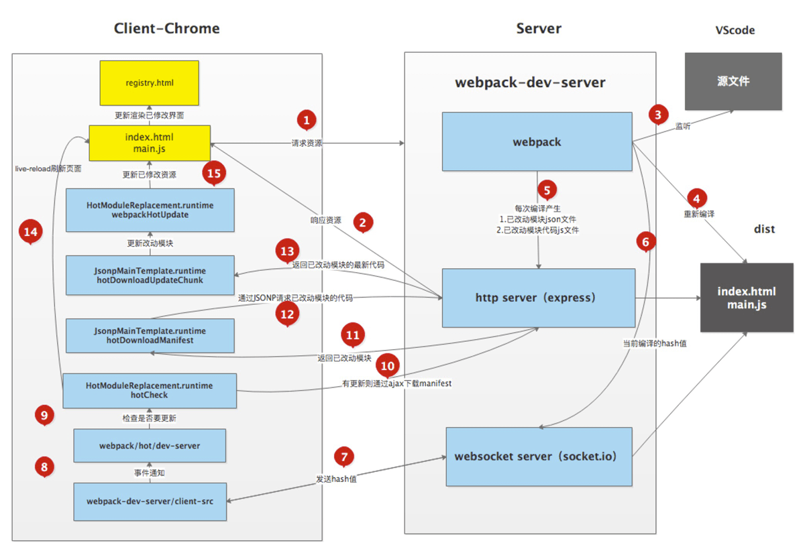

# Webpack 热更新的原理

## 一、基础概念

1. Webpack Compiler:  将JS编译成 Bundle

2. Bundle Server：提供文件在浏览器的访问，实际上就是一个服务器
3. HMR Server：将热更新的文件输出给HMR Runtime
4. HMR Runtime: 会被注入到bundle-js中，与HRM Server通过WebSocket链接，接收文件变化，并更新对应文件
5. bundle.js: 构建输出的文件

## 二、原理

#### 1. 启动阶段

Webpack Compiler 将对应文件打包成bundle.js(包含注入的HMR Server)，发送给Bundler Server
浏览器即可以访问服务器的方式获取bundlejs

#### 2. 更新阶段（即文件发生了变化）

1. Webpack Compiler 重新编译，发送给HMR Server
2. HMR Server 可以知道有哪些资源、哪些模块发生了变化，通知HRM Runtime
3. HRM Runtime更新代码

## 三、 HMR原理详解

* 使用webpack-dev-server去启动本地服务，内部实现主要使用了webpack、 express、 websocket。
* 使用express启动本地服务，当浏览器访问资源时对此做响应。
* 服务端和客户端使用websocket实现长连接
* webpack监听源文件的变化，即当开发者保存文件时触发webpack的重新编译。
  * 每次编译都会生成hash值、已改动模块的json文件、已改动模块代码的js文件
  * 编译完成后通过socket向客户端推送当前编译的hash戳
* 客户端的websocket监听到有文件改动推送过来的hash戳，会和上一次对比
  * 一致则走缓存
  * 不一致则通过ajax和isonp向服务端获取最新资源
* 使用内存文件系统去替换有修改的内容实现局部刷新

#### 1.server端

* 启动webpack-dev-server服务器
* 创建webpack实例
* 创建Server服务器
* 添加webpack的done事件回调
* 编译完成向客户端发送消息
* 创建express应用app
* 设置文件系统为内存文件系统
* 添加webpack-dev-middleware中间件
* 中间件负责返回生成的文件
* 启动webpack编译
* 创建http服务器并启动服务
* 使用sockjs在浏览器端和服务端之间建立一个 websocket 长连接
* 创建socket服务器

#### 2.client端

* webpack-dev-server/client端会监听到此hash消息

* 客户端收到ok的消息后会执行reloadApp方法进行更新

* 在reloadApp中会进行判断，是否支持热更新，如果支持的话发射webpackHotUpdate事件，如果不支持则直接刷新浏览器

* 在webpack/hot/dev-serverjs会监听webpackHotUpdate 事件

* 在check方法里会调用module.hot.check方法

* HotModuleReplacement.runtime请求Manifest

* 它通过调用 JsonpMainTemplate.runtime的hotDownloadManifest方法

* 调用JsonpMain Template.runtime的hotDownloadUpdateChunk方法通过JSONP请求获取到最新的模块代码

* 补丁JS取回来后会调用JsonpMainTemplate.runtime.js的webpackHotUpdate方法

* 然后会调用HotModuleReplacement.runtime.js的hotAddUpdateChunk方法动态更新模块代码

* 然后调用hotApply方法进行热更新