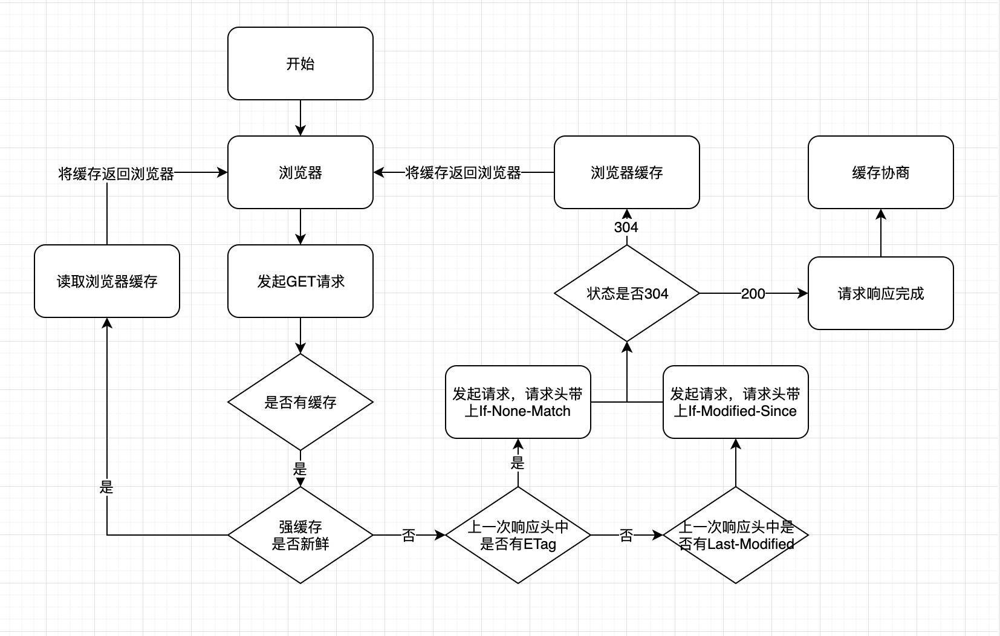
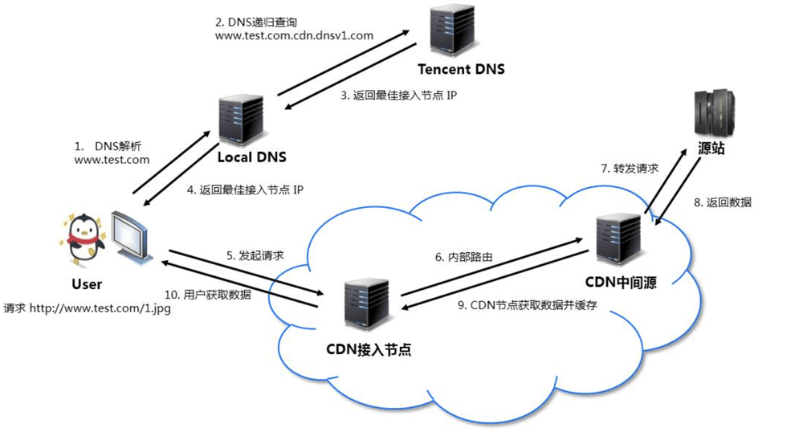
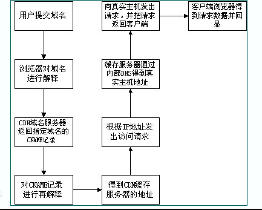

[toc]

# 浏览器缓存

浏览器缓存主要分为四个阶段：

1. `强制缓存阶段`：先在本地查找该资源，如果有发现该资源，而且该资源还没有过期，就使用这一个资源，完全不会发送 http 请求到服务器。
2. `协商缓存阶段`：让客户端与服务器之间能实现缓存文件是否更新的验证、提升缓存的复用率。如果在本地缓存找到对应的资源，但是不知道该资源是否过期或者已经过期，则发一个 http 请求到服务器，然后服务器判断这个请求，如果请求的资源在服务器上没有改动过，则返回 304，让浏览器使用本地找到的那个资源。
3. `启发式缓存阶段`：当缓存过期时间的字段一个都没有的时候，浏览器下次并不会直接进入协商阶段，而是先进入启发式缓存阶段，它根据响应头中2个时间：Date和Last-Modified 之间的时间差值，取其值的 10%作为缓存时间周期。也就是说， 当存有 Last-Modfied 字段的时候，即使是断网，且强缓存都失效后，也有一定时间是直接读取缓存文件的。etag 是没有这个阶段的。

4. `缓存失败阶段`：当服务器发现请求的资源已经修改过，或者这是一个新的请求(再本来没有找到资源)，服务器则返回该资源的数据，并且返回200，当然这个是指
找到资源的情况下，如果服务器上没有这个资源，则返回 404。

##### HTTP缓存都是从第二次请求开始的：

1. 第一次请求资源时，服务器返回资源，并在`response header`中回传资源的缓存策略；

2. 第二次请求时，浏览器判断这些请求参数，击中强缓存就直接200，否则就把请求参数加到`request header`头中传给服务器，看是否击中协商缓存，击中则返回304，否则服务器会返回新的资源。这是缓存运作的一个整体流程图：

   

## 一、强缓存

> 强缓存一般存放于 Memory Cache 或者 Disk Cache。

强缓存通过 Expires 和 Cache-Control 两个响应头实现

### 1.1 Expires

Expires 是 http1.0提出的一个表示资源过期时间的 header，它描述的是一个绝对时间，由服务器返回。
Expires 受限于本地时间，如果修改了本地时间，可能会造成缓存失效。
如：

> Expires: Wed Oct 21 2020 10:58:44 GMT

####  优势特点

* HTTP1.0的产物，可以在HTTP1.0和HTTP1.1中使用，简单易用
* 以时刻标识失效时间

#### 劣势问题

* 时间时有服务器发送的UTC，如果服务器时间和客户时间存在不一致，可能会出现问题
* 存在版本问题，到期之前你的修改客户是端不可知的

### 1.2 Cache -Control

Cache-Control 出现于 HTTP/1.1 优先级高于 Expires 表示的是相对时间

#### 缓存请求指令：

* `max-age=<seconds>`表示缓存内容将在 seconds 秒后失效
* `max-stale<=seconds>`客户端愿意接收一个已经过期了的响应。如果指定了 max-stale 的值，则最大容忍时间为对应的秒数。如果没有指定，那么说明浏览器愿意接收任何 age 的响应（age 表示响应由源站生成或确认的时间与当前时间的差值）
* `min-fresh=<seconds>`能够容忍的最小新鲜度。`min-fresh`标示了客户端不愿意接受新鲜度不多于当前的 age 加上 `min-fresh `设定的时间之和的响应
* `no-cache` 客户端缓存内容，是否使用缓存则需要经过协商缓存来验证决定.
* `no-store `所有内容都不会被缓存，即不使用强制缓存，也不使用协商缓存

#### 缓存响应指令： 

* `no-cache`
* `no-transform` 中间代理有时会改变图片以及文件的格式，从而达到提高性能的效果。no-transform 指令告诉中间代理不要改变资源的格式
* `public `所有内容都将被缓存（客户端和代理服务器都可缓存）
* `private` 所有内容只有客户端可以缓存，Cache-Control 的默认取值
* `max-age=<seconds>`
* `s-maxage=<seconds>`与` max-age` 类似

#### 优势特点

* HTTP1.1的产物，以时间间隔标识失效时间，解决了Expires服务器和客户端相对时间的问题
* 比Expires配置更丰富

#### 劣势问题

* 存在版本问题，到期之前的修改客户端是不可知的

## 二、协商缓存

当浏览器对资源的请求没有命中强缓存，就会发一个请求到服务器当中，去验证是否命中协商缓存，请求先攻返回的 http 状态为 304 响应字符串为` Not Modified` 而协商缓存时利用的是：`Last-Modified`,` If-Modified-Since`，`Etag`,` If-None-Match`。

### 2.1 Last-Modified、 If-Modified-Since

`last-Modified` 表示一个资源的最后更新时间，当需要进行协商缓存的时候，客户端会在请求头上加上` If-Modified-since `去询问在当前日期之后资源是否有更新，有的话，就需要将新的资源发送回来（200）有一种情况，如果在本地打开了缓存的文件，就会造成` Last-Modified` 被改了，为了解决这个问题，所以在 HTTE/1.1 增加了 `Etag`。

#### 优势特点

* 不存在版本问题，每次请求都会去服务器进行校验。服务器对比最后修改时间如果相同则返回304，不同返回200以及资源内容。

#### 劣势问题

* 只要资源修改，无论內容是否发生实质性的变化，都会将该资源返回客户端。例如周期性重写，这种情况下该资源包含的数据实际上一样的。
* 以时刻作为标识，无法识别一秒内进行多次修改的情况。如果资源更新的速度是秒以下单位，那么该缓存是不能被使用的，因为它的时间单位最低是秒。
* 某些服务器不能精确的得到文件的最后修改时间。
* 如果文件是通过服务器动态生成的，那么该方法的更新时间永远是生成的时间，尽管文件可能没有变化，所以起不到缓存的作用。

### 2.2 Etag,If-None-Match

`Etag `就像一个指纹，资源变化都会导致 比`Etag `变化，`Etag` 可以保证资源都是最新的。同样的，当命中了协商缓存，客户端就会发送上一次返回的 `Etag` 给服务器去询问当前资源是否更新，就需要发送新的资源。

1. `Etag `得优先级要高于` Last-Modified`

2. 一些文件会因为仅仅是修改时间发生了改变，而重新去获取资源，而使用 ETag
3. 文件修改频率非常频繁，如在秒级以下得改变，由于` If-Modified-Since `能检查到得最小是秒级得，这种改变` Last-Modified `就无法判断到进行了修改
4. 无法知道具体修改时间的服务器

etag 可以通过文件的` Last-Modified `和` content-length `计算。
Nginx官方默认的ETag计算方式是为"文件最后修改时间16进制-文件长度16进制"。例：`ETag: “59e72c84-2404”`

#### 优势特点

* 可以更加精确的判断资源是否被修改，可以识别一秒内多次修改的情况。
* 不存在版本问题，每次请求都回去服务器进行校验。

#### 劣势问题

* 计算ETag值需要性能损耗。
* 分布式服务器存储的情况下，计算ETag的算法如果不一样，会导致浏览器从一台服务器上获得页面内容后到另外一台服务器上进行验证时现ETa9不匹配的情况。

> 注意：
> 不管怎么样的算法，在服务器端都要进行计算，计算就有开销，会带来性能损失。因此为了榨干这一点点性能，不少网站完全把Etag禁用了(比如Yahool)，这其实不符合HTTP/1.1的规定，因为HTTP/11总是鼓励服务器尽可能的开启Etag。

## 三、总结

强制缓存优先于协商缓存进行，若强制缓存(`Expires` 和 `Cache-Control`)生效则直接使用缓存，若不生效则进行协商缓存(`Last-Modified / If-Modified-Since` 和` Etag / If-None-Match`)，协商缓存由服务器决定是否使用缓存，若协商缓存失效，那么代表该请求的缓存失效，返回 200，重新返回资源和缓存标识，再存入浏览器缓存中；生效则返回 304，继续使用缓存。

1. 对于频繁变动的资源，首先需要使用` Cache-Control:no-cache `使浏览器每次都请求服务器，然后配合 ETag 或者` Last-Modified` 来验证资源是否有效。这样的做法虽然不能节省请求数量，但是能显著减少响应数据大小。
2. 处理不常变化的资源时，给它们的` Cache-Control `配置一个很大的` max-age=31536000`(一年)，这样浏览器之后请求相同的 URL 会命中强制缓存。而为了解决更新的问题，就需要在文件名(或者路径)中添加 hash，版本号等动态字符，之后更改动态字符，从而达到更改引用 URL 的目的，让之前的强制缓存失效（其实并未立即失效，只是不再使用了而己)。在线提供的类库（如jquery-3.3.1.min.js，lodash.min.js等）均采用这个模式。

# 其他缓存

>  memcache、 redis、 squid、 varnish、 web cache、 CDN 等等都是缓存相关的。

## 一、数据库缓存

我们知道常见的数据库，比如 oracle、mysql 等，数据都是存放在磁盘中。虽然在数据库层也做了对应的缓存，但这种数据库层次的缓存一般针对的是查询內容，而且粒度也太小，一般只有表中数据没有变更的时候，数据库对应的 cache 才发挥了作用。但这并不能减少业务系统对数据库产生的增、删、查、改的庞大 10 压力。所以数据库缓存技术在此诞生，实现热点数据的高速缓存，提高应用的响应速度，极大缓解后端数据库的压力。

## 二、静态缓存

静态缓存技术，CDN 是经典代表之作。静态缓存技术面非常广，涉及的开源技术包含 apache、 Lighttpd、 nginx、 varnish、 squid 等。
静态缓存，一般指 web 类应用中，将图片、js、css、视频、html 等静态文件/资源通过磁盘/内存等缓存方式，提高资源响应方式，减少服务器压力/资源开销的一门缓存技术。
静态缓存又可以简单的分类，有浏览器缓存、磁盘缓存、内存缓存、nginx 的内存缓存、CDN 等等。

### 2.1 浏览器缓存

浏览器缓存，也称为客户端缓存，是静态缓存中最常见最直接的表现形式，很多时候都往往被人忽略掉。
比如 nginx 配置中 可以配置

```nginx
location ~ .*\.(?:jpg|jpeg|gif|png|ico|cur|gz|svg|svgz|mp4|ogg|ogv|webm)$
{
    expires      7d;
}

location ~ .*\.(?:js|css)$
{
    expires      7d;
}
```

### 2.2 磁盘缓存

除了存储在客户端的静态缓存(浏览器静态）技术外，在服务器端的静态缓存技术主要分为磁盘缓存和内存缓存两大类。
磁盘缓存顾名思义就是存储到了磁盘上。
内存缓存就是把静态文件缓存在服务器端的内存中。所以这种缓存，如若命中缓存的话，取内存中的缓存数据返回比取磁盘中的缓存数据返回，性能要高很多。

### 2.3 CDN

它是静态缓存加速最典型的代表。CDN 技术并不是一门新的技术，它是基于传统 nginx、squid、 varnish 等 web 缓存技术，结合 DNS 智能解析的静态缓存加速技术。值得注意的是，他对动态链接访问并没有加速效果。

简单地说，CDN是一个经策略性部署的整体系统，包括分布式存储、负载均衡、网络请求的重定向和内容管理4个要件，而内容管理和全局的网络流量管理(Traffic Management)是CDN的核心所在。
通过用户就近性和服务器负载的判断，CDN确保内容以一种极为高效的方式为用户的请求提供服务。

CDN 的静态缓存技术核心主要在于两点：

1. `节点缓行`：对需要加速的网的应用，相应的静态资源通过内存缓存+磁盘缓存的方式缓存在服务器端。
2. `精准调度`：对访问的用户 ip 进行智能解析调度，实现就近缓存节点访问。比如北京用户访问 `www.a.com` 。通过 dns 解析的时候，分析用户 ip，发现是北京用户。则 dns 返回对应北京缓存节点的ip 地址给到用户，则用户 `www.a.com` 默认访问北京服务器上面存数据，实现就近访问的策略，大大提升了访问速度。

#### 完整流程

1. 客户端向服务器请求一个静态资源，如请求cdn服务器的query文件， `http://code jquery.com/jquery-migrate-1.2.1.min-js`，首先会进行dns域名解析，但这里解析出来不是直接返回源站ip，而是解析到一个智能dns服务器。
2. 这个智能dns服务器会将离用户最近的cdn服务器的ip返回给客户端。
3. 客户端向cdn服务器获取jquery文件，如果改服务器有这个静态资源并且未过期，这个jquery文件将直接返回给客户端 
4. 如果cdn服务器有该静态资源，但已过期，会向源站询问是否更改，未变更则直接返回该文件并延长有效期，如果源站文件变更，重新从源站获取并缓存到自己的cnd服务器。
5. 源站也可以主动更新cdn网络下的静态资源以确保客户端最快的获取到最新的资源。



#### 原理

在描述CDN的实现原理之前，让我们先看传统的未加缓存服务的访问过程，以便了解CDN缓存访问方式与末加缓存访问方式的差别：
用户提交域名一浏览器对域名进行解释一得到目的主机的P地址一根据1P地址访问发出请求一得到请求数据并回复
由上可见，用户访问未使用CDN缓存网站的过程为：

1. 用户向浏览器提供要访问的域名；
2. 浏览器调用域名解析函数库对域名进行解析，以得到此域名对应的P地址；
3. 浏览器使用所得到的/P地址，向域名的服务主机发出数据访问请求;
4. 浏览器根据域名主机返回的数据显示网页的内容。

通过以上四个步骤，浏览器完成从用户处接收用户要访问的域名到从域名服务主机处获取数据的整个过程。
CDN网络是在 用户和服务器之问增加Cache层，如何将用户的请求引导到Cache 上获得源服务器的数据，主要是通过接管DNS实现，下面让我们看看访问使用CDN缓 存后的网站的过程：



#### 优化机制

1. 资源调度：CDN会根据用户接入网络的ip寻找距离用户最优路径的服务器。调度的方式主要有DNS调度、http 302调度、使用 HTTP 进行的 DNS 调度 (多用于移动端）；
2. 缓存策略和数据检索：CDN服务器使用高效的算法和数据结构，快速的检索资源和更新读取缓存；
   * 网络优化：从OS七层模型进行优化，达到网络优化的目的。
   *  L1物理层：硬件设备升级提高速度
   * L2数据链路层：寻找更快的网络节点、确保 Lastmile 尽量短
   * L3路由层：路径优化，寻找两点间最优路径
   * L4传输层：协议TCP优化，保持长连接、TCP快速打开
   *  L7应用层：静态资源压缩、请求合并

## 三、前端常用缓存技术

### 3.1 Http 缓存

当客户端第一次完成数据请求后，浏览器会缓存本次请求的数据，当下次执行相同请求，则直接在缓存数据库中返回；但 HTTP 缓存有多种规则，根据是否向服务器发送请求分为“强缓存”和“协商缓存”两种。
两者的主要区别是使用本地缓存的时候，是否需要向服务器验证本地缓存是否依旧有效。顾名思义，协商缓存，就是需要和服务器进行协商，最终确定是否使用本地缓存。

#### 最佳实践

缓存的意义就在于减少请求，更多地使用本地的资源，给用户更好的体验的同时，也减轻服务器压力。所以，最佳实践，就应该是尽可能命中强缓存，同时，能在更新版本的时候让客户端的缓存失效。
在更新版本之后，如何让用户第一时间使用最新的资源文件呢？机智的前端们想出了一个方法，在更新版本的时候，顺便把静态资源的路径改了，这样，就相当于第一次访问这些资源，就不会存在缓存的问题了。
现在我们在使用 webpack 打包的时候，可以在文件名上带上 hash 值。
所以，可以得出一个比较合理的缓存方案
HTML：使用协商缓存。
CSS&JS&图片：使用强缓存，文件命名带上 hash 值。

#### 配置方式

###### 强缓

```js
res.setHeader("Cache-Control", "public, max-age=xxx");
```

###### 协商缓存

```js
res.setHeader("Cache-Control", "public, max-age=0");
res.setHeader("Last-Modified", xxx);
res.setHeader("ETag", xxx);
```

### 3.2 Service Worker 离线缓存

`Service Worker` 能够充当网络代理服务器的功能，能拦截网络请求 (fetch）、离线缓存

* `Service Worker` 是运行在 worker 上下文，所以不能访问 DOM
* 运行在其他线程中，不会造成拥堵，完全异步，因此同步 API 不可使用
* 只能在 https 或本地 localhost 上运行

#### 使用

###### 注册 service Worker

```html
<!DOCTYPE html>
<html lang="en">
  <head>
    <meta charset="UTF-8" />
    <meta name="viewport" content="width=device-width, initial-scale=1.0" />
    <meta http-equiv="X-UA-Compatible" content="ie=edge" />
    <title>serviceWorker</title>
    <script type="text/javascript">
      if ("serviceWorker" in navigator) {
        navigator.serviceWorker
          .register("./serviceWorker.js", { scope: "./" })
          .then((registration) => {
            console.log("注册成功", registration.scope);
          })
          .catch((err) => {
            console.log("注册失败", err);
          });
      }
    </script>
  </head>
  <body></body>
</html>
```

###### ServerWorker.js

```js
let self = this;
// 完成serviceWorker的注册与缓存文件
self.addEventListener("install", function (event) {
  event.waitUntil(
    caches.open("v1").then(function (cache) {
      return cache.addAll([
        "./index.html", //缓存文件
      ]);
    })
  );
});

// 监听拦截http请求，做资源缓存
self.addEventListener("fetch", function (event) {
  event.responseWith(
    // 在缓存中匹配请求
    caches.match(event.request).then(function (response) {
      // 若缓存存在，则直接返回
      if (response) {
        return response;
      }
      // 拷贝request副本
      let fetchRequest = event.request.clone();
      // 未命中缓存，发起网络请求
      return fetch(fetchRequest).then(function (response) {
        // 判断是否请求成功
        if (!response || response.status != 200 || response.type != "basic") {
          return response;
        }
        // 缓存请求和响应数据
        let fetchResponse = response.clone();
        caches.open("v1").then(function (cache) {
          cache.put(event.request, fetchResponse);
        });
        // 返回真实的网络请求数据
        return response;
      });
    })
  );
});
```

### 3.3 mainfest

html5 引入的新标准，可以离线缓存静态文件

#### 优点：

* 离线浏览
* 已缓存资源加载速度更快
* 减轻服务器负载 - 只需从服务器中获取更新或修改过的资源

#### 使用

新建一个后缀为`manifest.appcache `的文件，文件内容如下

```
CACHE MANIFEST // 首次完成请求后进行缓存，离线可访问
manifest.css

NETWORK: // 每次请求都需要网络，不缓存
network.css

FALLBACK: // 页面无法连接网络时显示的页面
404.html
```

- 在中加入 manifest 属性并指定文件所在地址

```html
<html manifest="manifest.appcache">
```

# PWA

## 简介

PWA (Progressive web apps，渐进式 Web 应用）运用现代的 Web API 以及传统的渐进式增强策略来创建跨平台 Web 应用程序。

### 什么是PWA应用？

PWA应用是指那些使用指定技术和标准模式来开发的web应用，这将同时赋予它们web应用和原生应用的特性。
举例：PWA既能像网站那么快捷，又能像QQ、微信一样离线在本地运行

### 什么使应用成为PWA

**总体依据**：当应用程序满足某些要求时，可以将其视为PWA，或者实现一组给定的功能：离线工作，可安装，易于同步，可以发送推送通知等。
**辨别工具：**还有一些工具可以按百分比衡量应用的完整性。(Lighthouse目前是最受欢迎的工具）通过实施各种技术优势，我们可以使应用程序更加渐进式，从而最终获得更高的Lighthouse 得分。但这只是一个粗略的指标。
**辨别原则：**这里有一些关键的原则来辨别一个web应用是否是一个PWA应用。它应该具有以下特点：

* `Discoverable`，内容可以通过搜索引擎发现。
* `Installable`， 可以出现在设备的主屏幕。
* `Linkable`， 你可以简单地通过一个URL来分享它。
* `Network independent`，它可以在离线状态或者是在网速很差的情况下运行。
* `Progressive`，它在老版本的浏览器仍旧可以使用，在新版本的浏览器上可以使用全部功能。
* `Re-engageable`，无论何时有新的内容它都可以发送通知。
* `Responsive`，它在任何具有屏幕和浏览器的设备上可以正常使用—包括手机，平板电脑，笔记本，电视，冰箱，等。
* `Safe`，在你和应用之间的连接是安全的，可以阻止第三方访问你的敏感数据。

### PWA优势

我们需要在设计网站时时刻记住PWA的优势。app shell允许网站：

* 可访问：即使看起来像个本地应用，请记住它仍然是个网站——你可以点击页面中的连接并分享给你的朋友。
* 渐进式：先从“好用的，旧式的网站”出发，一步步渐进式的增加新特性，记住要随时侦测浏览器是否可用这些新增加的特性，同时注意处理任何由于浏览器不支持而导致的error。例如，`service workers`可以让离线工作成为可能，同时提高网站的体验，但是记住就算没有`service worker`网站也应该能运行良好。
* 响应式：响应式页面设计也适用于渐进式web应用，主要是针对移动端设备。有许多不同的设备配置有浏览器——你需要让网站支持不同的屏幕尺寸，视窗 (`view port`）或者是不同的像素密度(`pixel density`)，常用的技术有`viewport meta tag`, `CSS media queries`, `Flexbox`。

### PWA存在的问题

1. 支持率不高;现在ios手机端不支持pwa，IE也暂时不支持
2. Chrome在中国桌面版占有率还是不错的，安卓移动端上的占有率却很低
3. 各大厂商还未明确支持pwa
4. 依赖的GCM服务在国内无法使用
5. 微信小程序的竞争

## 关键技术

1. Manifest
2. Server Worker

### Manifest实现添加至主屏幕

#### Index.html

```html
<head>
  <title>Minimal PWA</title>
  <meta name="viewport" content="width=device-width, user-scalable=no" />
  <link rel="manifest" href="manifest.json" />
  <link rel="stylesheet" type="text/css" href="main.css">
  <link rel="icon" href="/e.png" type="image/png" />
</head>
```

#### Manifest.json

```json
{
  "name": "Minimal PWA", // 必填 显示的插件名称
  "short_name": "PWA Demo", // 可选  在APP launcher和新的tab页显示，如果没有设置，则使用name
  "description": "The app that helps you understand PWA", //用于描述应用
  "display": "standalone", // 定义开发人员对Web应用程序的首选显示模式。standalone模式会有单独的
  "start_url": "/", // 应用启动时的url
  "theme_color": "#313131", // 桌面图标的背景色
  "background_color": "#313131", // 为web应用程序预定义的背景颜色。在启动web应用程序和加载应用程序的内容之间创建了一个平滑的过渡。
  "icons": [ // 桌面图标，是一个数组
    {
    "src": "icon/lowres.webp",
    "sizes": "48x48",  // 以空格分隔的图片尺寸
    "type": "image/webp"  // 帮助userAgent快速排除不支持的类型
  },
  {
    "src": "icon/lowres",
    "sizes": "48x48"
  },
  {
    "src": "icon/hd_hi.ico",
    "sizes": "72x72 96x96 128x128 256x256"
  },
  {
    "src": "icon/hd_hi.svg",
    "sizes": "72x72"
  }
  ]
}
```

### service worker实现离线缓存

Service Worker 是 Chrome 团队提出和力推的一个 WEB API，用于给 web 应用提供高级的可持续的后台处理能力。
Service Workers 就像介于服务器和网页之间的拦截器，能够拦截进出的HTTP 请求，从而完全控制你的网站。

#### 最主要的特点

1. 在页面中注册并安装成功后，运行于浏览器后台，不受页面刷新的影响，可以监听和截拦作用域范围内所有页面的 HTTP 请求。
2. 网站必须使用 HTTPS。除了使用本地开发环境调试时(如域名使用 localhost)
3. 运行于浏览器后台，可以控制打开的作用域范围下所有的页面请求
4. 单独的作用域范围，单独的运行环境和执行线程
5. 不能操作页面 DOM。但可以通过事件机制来处理
6. 事件驱动型服务线程