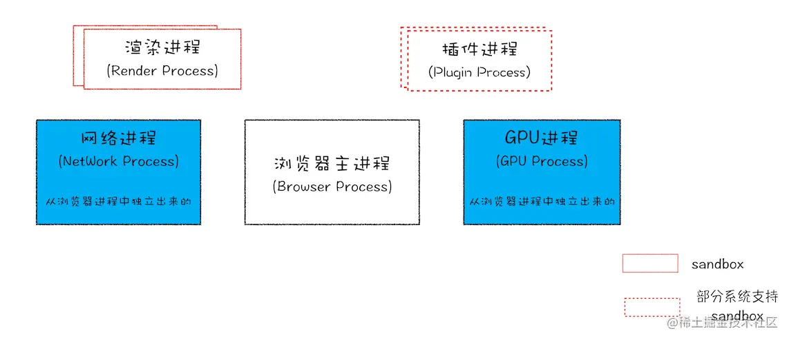
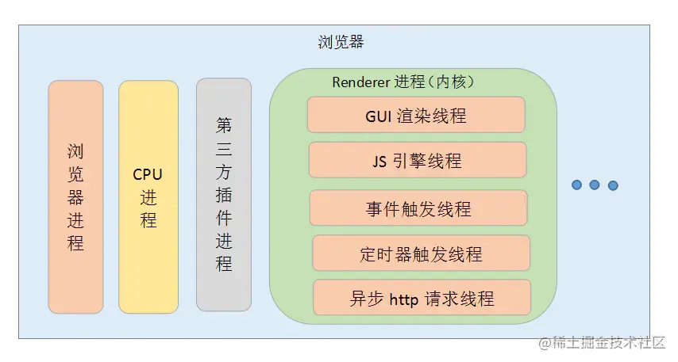
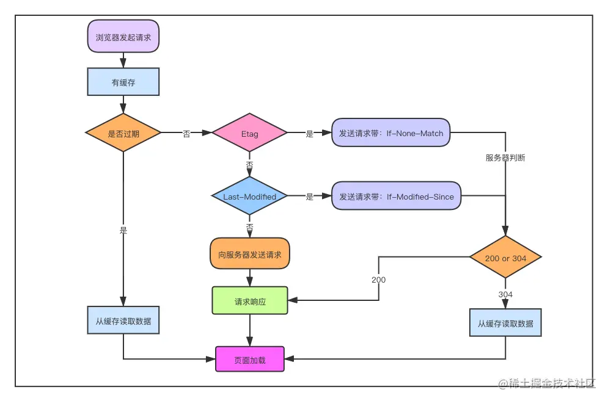
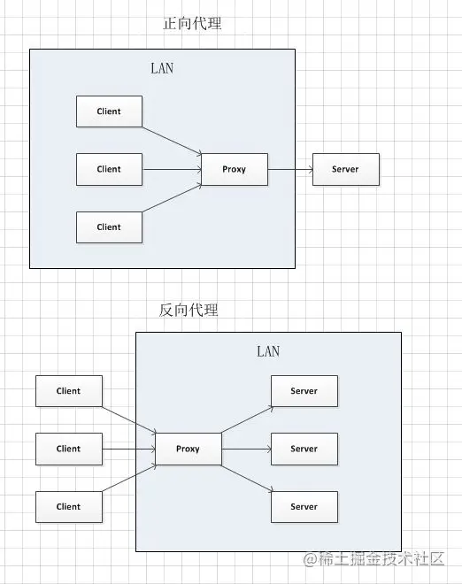
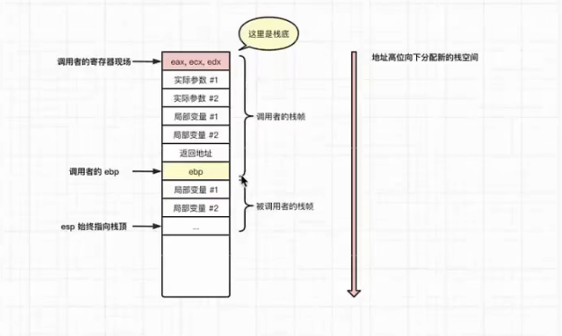

[toc]

## 浏览器安全

### 什么是 XSS 攻击？

#### （1）概念

 XSS 攻击指的是跨站脚本攻击，是一种代码注入攻击。攻击者通过在网站注入恶意脚本，使之在用户的浏览器上运行，从而盗取用户的信息如 cookie 等。

 XSS 的本质是因为网站没有对恶意代码进行过滤，与正常的代码混合在一起了，浏览器没有办法分辨哪些脚本是可信的，从而导致了恶意代码的执行。

 攻击者可以通过这种攻击方式可以进行以下操作：

- 获取页面的数据，如DOM、cookie、localStorage；

- DOS攻击，发送合理请求，占用服务器资源，从而使用户无法访问服务器；

- 破坏页面结构；

- 流量劫持（将链接指向某网站）；

#### （2）攻击类型

 XSS 可以分为存储型、反射型和 DOM 型：

- 存储型指的是恶意脚本会存储在目标服务器上，当浏览器请求数据时，脚本从服务器传回并执行。

- 反射型指的是攻击者诱导用户访问一个带有恶意代码的 URL 后，服务器端接收数据后处理，然后把带有恶意代码的数据发送到浏览器端，浏览器端解析这段带有 XSS 代码的数据后当做脚本执行，最终完成 XSS 攻击。 

- DOM 型指的通过修改页面的 DOM 节点形成的 XSS。

**1）存储型 XSS 的攻击步骤：**

1. 攻击者将恶意代码提交到⽬标⽹站的数据库中。
2. ⽤户打开⽬标⽹站时，⽹站服务端将恶意代码从数据库取出，拼接在 HTML 中返回给浏览器。
3. ⽤户浏览器接收到响应后解析执⾏，混在其中的恶意代码也被执⾏。
4. 恶意代码窃取⽤户数据并发送到攻击者的⽹站，或者冒充⽤户的⾏为，调⽤⽬标⽹站接⼝执⾏攻击者指定的操作。

 这种攻击常⻅于带有⽤户保存数据的⽹站功能，如论坛发帖、商品评论、⽤户私信等。

 **2）反射型 XSS 的攻击步骤：**

1. 攻击者构造出特殊的 URL，其中包含恶意代码。
2. ⽤户打开带有恶意代码的 URL 时，⽹站服务端将恶意代码从 URL 中取出，拼接在 HTML 中返回给浏览器。
3. ⽤户浏览器接收到响应后解析执⾏，混在其中的恶意代码也被执⾏。
4. 恶意代码窃取⽤户数据并发送到攻击者的⽹站，或者冒充⽤户的⾏为，调⽤⽬标⽹站接⼝执⾏攻击者指定的操作。

 反射型 XSS 跟存储型 XSS 的区别是：存储型 XSS 的恶意代码存在数据库⾥，反射型 XSS 的恶意代码存在 URL ⾥。

 反射型 XSS 漏洞常⻅于通过 URL 传递参数的功能，如⽹站搜索、跳转等。 由于需要⽤户主动打开恶意的 URL 才能⽣效，攻击者往往会结合多种⼿段诱导⽤户点击。

 **3）DOM 型 XSS 的攻击步骤：**

1. 攻击者构造出特殊的 URL，其中包含恶意代码。
2. ⽤户打开带有恶意代码的 URL。
3. ⽤户浏览器接收到响应后解析执⾏，前端 JavaScript 取出 URL 中的恶意代码并执⾏。
4. 恶意代码窃取⽤户数据并发送到攻击者的⽹站，或者冒充⽤户的⾏为，调⽤⽬标⽹站接⼝执⾏攻击者指定的操作。

 DOM 型 XSS 跟前两种 XSS 的区别：DOM 型 XSS 攻击中，取出和执⾏恶意代码由浏览器端完成，属于前端JavaScript ⾃身的安全漏洞，⽽其他两种 XSS 都属于服务端的安全漏洞。

### 如何防御 XSS 攻击？

- 可以从浏览器的执行来进行预防，一种是使用纯前端的方式，不用服务器端拼接后返回（不使用服务端渲染）。另一种是对需要插入到 HTML 中的代码做好充分的转义。对于 DOM 型的攻击，主要是前端脚本的不可靠而造成的，对于数据获取渲染和字符串拼接的时候应该对可能出现的恶意代码情况进行判断。
- 使用 CSP ，CSP 的本质是建立一个白名单，告诉浏览器哪些外部资源可以加载和执行，从而防止恶意代码的注入攻击。

1. > CSP 指的是内容安全策略，它的本质是建立一个白名单，告诉浏览器哪些外部资源可以加载和执行。我们只需要配置规则，如何拦截由浏览器自己来实现。

2. > 通常有两种方式来开启 CSP，一种是设置 HTTP 首部中的 Content-Security-Policy，一种是设置 meta 标签的方式

- 对一些敏感信息进行保护，比如 cookie 使用 http-only，使得脚本无法获取。也可以使用验证码，避免脚本伪装成用户执行一些操作。

### 什么是 CSRF 攻击？

#### （1）概念

 CSRF 攻击指的是**跨站请求伪造攻击**，攻击者诱导用户进入一个第三方网站，然后该网站向被攻击网站发送跨站请求。如果用户在被攻击网站中保存了登录状态，那么攻击者就可以利用这个登录状态，绕过后台的用户验证，冒充用户向服务器执行一些操作。

 CSRF 攻击的**本质是利用 cookie 会在同源请求中携带发送给服务器的特点，以此来实现用户的冒充。**

#### （2）攻击类型

 常见的 CSRF 攻击有三种：

- GET 类型的 CSRF 攻击，比如在网站中的一个 img 标签里构建一个请求，当用户打开这个网站的时候就会自动发起提交。

- POST 类型的 CSRF 攻击，比如构建一个表单，然后隐藏它，当用户进入页面时，自动提交这个表单。

- 链接类型的 CSRF 攻击，比如在 a 标签的 href 属性里构建一个请求，然后诱导用户去点击。

### 如何防御 CSRF 攻击？

**CSRF 攻击可以使用以下方法来防护：**

- **进行同源检测**，服务器根据 http 请求头中 origin 或者 referer 信息来判断请求是否为允许访问的站点，从而对请求进行过滤。当 origin 或者 referer 信息都不存在的时候，直接阻止请求。这种方式的缺点是有些情况下 referer 可以被伪造，同时还会把搜索引擎的链接也给屏蔽了。所以一般网站会允许搜索引擎的页面请求，但是相应的页面请求这种请求方式也可能被攻击者给利用。（Referer 字段会告诉服务器该网页是从哪个页面链接过来的）
-  **使用 CSRF Token 进行验证**，服务器向用户返回一个随机数 Token ，当网站再次发起请求时，在请求参数中加入服务器端返回的 token ，然后服务器对这个 token 进行验证。这种方法解决了使用 cookie 单一验证方式时，可能会被冒用的问题，但是这种方法存在一个缺点就是，我们需要给网站中的所有请求都添加上这个 token，操作比较繁琐。还有一个问题是一般不会只有一台网站服务器，如果请求经过负载平衡转移到了其他的服务器，但是这个服务器的 session 中没有保留这个 token 的话，就没有办法验证了。这种情况可以通过改变 token 的构建方式来解决。
-  **对 Cookie 进行双重验证**，服务器在用户访问网站页面时，向请求域名注入一个Cookie，内容为随机字符串，然后当用户再次向服务器发送请求的时候，从 cookie 中取出这个字符串，添加到 URL 参数中，然后服务器通过对 cookie 中的数据和参数中的数据进行比较，来进行验证。使用这种方式是利用了攻击者只能利用 cookie，但是不能访问获取 cookie 的特点。并且这种方法比 CSRF Token 的方法更加方便，并且不涉及到分布式访问的问题。这种方法的缺点是如果网站存在 XSS 漏洞的，那么这种方式会失效。同时这种方式不能做到子域名的隔离。
-  **在设置 cookie 属性的时候设置 Samesite ，限制 cookie 不能作为被第三方使用**，从而可以避免被攻击者利用。Samesite 一共有两种模式，一种是严格模式，在严格模式下 cookie 在任何情况下都不可能作为第三方 Cookie 使用，在宽松模式下，cookie 可以被请求是 GET 请求，且会发生页面跳转的请求所使用。

### 什么是中间人攻击？如何防范中间人攻击？

中间⼈ (Man-in-the-middle attack, MITM) 是指攻击者与通讯的两端分别创建独⽴的联系, 并交换其所收到的数据, 使通讯的两端认为他们正在通过⼀个私密的连接与对⽅直接对话, 但事实上整个会话都被攻击者完全控制。在中间⼈攻击中，攻击者可以拦截通讯双⽅的通话并插⼊新的内容。

攻击过程如下:

- 客户端发送请求到服务端，请求被中间⼈截获

- 服务器向客户端发送公钥

- 中间⼈截获公钥，保留在⾃⼰⼿上。然后⾃⼰⽣成⼀个**伪造的**公钥，发给客户端

- 客户端收到伪造的公钥后，⽣成加密hash值发给服务器

- 中间⼈获得加密hash值，⽤⾃⼰的私钥解密获得真秘钥,同时⽣成假的加密hash值，发给服务器

- 服务器⽤私钥解密获得假密钥,然后加密数据传输给客户端

### 有哪些可能引起前端安全的问题?

- 跨站脚本 (Cross-Site Scripting, XSS): ⼀种代码注⼊⽅式, 为了与 CSS 区分所以被称作 XSS。早期常⻅于⽹络论坛, 起因是⽹站没有对⽤户的输⼊进⾏严格的限制, 使得攻击者可以将脚本上传到帖⼦让其他⼈浏览到有恶意脚本的⻚⾯, 其注⼊⽅式很简单包括但不限于 JavaScript / CSS / Flash 等；
-  iframe的滥⽤: iframe中的内容是由第三⽅来提供的，默认情况下他们不受控制，他们可以在iframe中运⾏JavaScirpt脚本、Flash插件、弹出对话框等等，这可能会破坏前端⽤户体验；
-  跨站点请求伪造（Cross-Site Request Forgeries，CSRF）: 指攻击者通过设置好的陷阱，强制对已完成认证的⽤户进⾏⾮预期的个⼈信息或设定信息等某些状态更新，属于被动攻击
-  恶意第三⽅库: ⽆论是后端服务器应⽤还是前端应⽤开发，绝⼤多数时候都是在借助开发框架和各种类库进⾏快速开发，⼀旦第三⽅库被植⼊恶意代码很容易引起安全问题。

### 网络劫持有哪几种，如何防范？

⽹络劫持分为两种:

 （1）**DNS劫持**: (输⼊京东被强制跳转到淘宝这就属于dns劫持)

- DNS强制解析: 通过修改运营商的本地DNS记录，来引导⽤户流量到缓存服务器

- 302跳转的⽅式: 通过监控⽹络出⼝的流量，分析判断哪些内容是可以进⾏劫持处理的,再对劫持的内存发起302跳转的回复，引导⽤户获取内容

 （2）**HTTP劫持**: (访问⾕歌但是⼀直有贪玩蓝⽉的⼴告),由于http明⽂传输,运营商会修改你的http响应内容(即加⼴告)

 DNS劫持由于涉嫌违法，已经被监管起来，现在很少会有DNS劫持，⽽http劫持依然⾮常盛⾏，最有效的办法就是全站HTTPS，将HTTP加密，这使得运营商⽆法获取明⽂，就⽆法劫持你的响应内容。

## 进程与线程的概念

从本质上说，进程和线程都是 CPU 工作时间片的一个描述：

- 进程描述了 CPU 在运行指令及加载和保存上下文所需的时间，放在应用上来说就代表了一个程序。

- 线程是进程中的更小单位，描述了执行一段指令所需的时间。

 **进程是资源分配的最小单位，线程是CPU调度的最小单位。**

 一个进程就是一个程序的运行实例。详细解释就是，启动一个程序的时候，操作系统会为该程序创建一块内存，用来存放代码、运行中的数据和一个执行任务的主线程，我们把这样的一个运行环境叫**进程**。**进程是运行在虚拟内存上的，虚拟内存是用来解决用户对硬件资源的无限需求和有限的硬件资源之间的矛盾的。从操作系统角度来看，虚拟内存即交换文件；从处理器角度看，虚拟内存即虚拟地址空间。**

 如果程序很多时，内存可能会不够，操作系统为每个进程提供一套独立的虚拟地址空间，从而使得同一块物理内存在不同的进程中可以对应到不同或相同的虚拟地址，变相的增加了程序可以使用的内存。

进程和线程之间的关系有以下四个特点：

 **（1）进程中的任意一线程执行出错，都会导致整个进程的崩溃。**

 **（2）线程之间共享进程中的数据。**

 **（3）当一个进程关闭之后，操作系统会回收进程所占用的内存，** 当一个进程退出时，操作系统会回收该进程所申请的所有资源；即使其中任意线程因为操作不当导致内存泄漏，当进程退出时，这些内存也会被正确回收。

 **（4）进程之间的内容相互隔离。** 进程隔离就是为了使操作系统中的进程互不干扰，每一个进程只能访问自己占有的数据，也就避免出现进程 A 写入数据到进程 B 的情况。正是因为进程之间的数据是严格隔离的，所以一个进程如果崩溃了，或者挂起了，是不会影响到其他进程的。如果进程之间需要进行数据的通信，这时候，就需要使用用于进程间通信的机制了。



从图中可以看出，最新的 Chrome 浏览器包括：

- 1 个浏览器主进程

- 1 个 GPU 进程

- 1 个网络进程

- 多个渲染进程

- 多个插件进程

这些进程的功能：

- **浏览器进程**：主要负责界面显示、用户交互、子进程管理，同时提供存储等功能。
- **渲染进程**：核心任务是将 HTML、CSS 和 JavaScript 转换为用户可以与之交互的网页，排版引擎 Blink 和 JavaScript 引擎 V8 都是运行在该进程中，默认情况下，Chrome 会为每个 Tab 标签创建一个渲染进程。出于安全考虑，渲染进程都是运行在沙箱模式下。
- **GPU 进程**：其实， GPU 的使用初衷是为了实现 3D CSS 的效果，只是随后网页、Chrome 的 UI 界面都选择采用 GPU 来绘制，这使得 GPU 成为浏览器普遍的需求。最后，Chrome 在其多进程架构上也引入了 GPU 进程。
- **网络进程**：主要负责页面的网络资源加载，之前是作为一个模块运行在浏览器进程里面的，直至最近才独立出来，成为一个单独的进程。
- **插件进程**：主要是负责插件的运行，因插件易崩溃，所以需要通过插件进程来隔离，以保证插件进程崩溃不会对浏览器和页面造成影响。

所以，**打开一个网页，最少需要四个进程**：1 个网络进程、1 个浏览器进程、1 个 GPU 进程以及 1 个渲染进程。如果打开的页面有运行插件的话，还需要再加上 1 个插件进程。

 虽然多进程模型提升了浏览器的稳定性、流畅性和安全性，但同样不可避免地带来了一些问题：

- **更高的资源占用**：因为每个进程都会包含公共基础结构的副本（如 JavaScript 运行环境），这就意味着浏览器会消耗更多的内存资源。

- **更复杂的体系架构**：浏览器各模块之间耦合性高、扩展性差等问题，会导致现在的架构已经很难适应新的需求了。

### 进程和线程的区别

- 进程可以看做独立应用，线程不能
-  资源：进程是cpu资源分配的最小单位（是能拥有资源和独立运行的最小单位）；线程是cpu调度的最小单位（线程是建立在进程的基础上的一次程序运行单位，一个进程中可以有多个线程）。
-  通信方面：线程间可以通过直接共享同一进程中的资源，而进程通信需要借助 进程间通信。
-  调度：进程切换比线程切换的开销要大。线程是CPU调度的基本单位，线程的切换不会引起进程切换，但某个进程中的线程切换到另一个进程中的线程时，会引起进程切换。
-  系统开销：由于创建或撤销进程时，系统都要为之分配或回收资源，如内存、I/O 等，其开销远大于创建或撤销线程时的开销。同理，在进行进程切换时，涉及当前执行进程 CPU 环境还有各种各样状态的保存及新调度进程状态的设置，而线程切换时只需保存和设置少量寄存器内容，开销较小。

### 浏览器渲染进程的线程有哪些

浏览器的渲染进程的线程总共有五种：



**（1）GUI渲染线程** 负责渲染浏览器页面，解析HTML、CSS，构建DOM树、构建CSSOM树、构建渲染树和绘制页面；当界面需要**重绘**或由于某种操作引发**回流**时，该线程就会执行。

 注意：GUI渲染线程和JS引擎线程是互斥的，当JS引擎执行时GUI线程会被挂起，GUI更新会被保存在一个队列中等到JS引擎空闲时立即被执行。

**（2）JS引擎线程** JS引擎线程也称为JS内核，负责处理Javascript脚本程序，解析Javascript脚本，运行代码；JS引擎线程一直等待着任务队列中任务的到来，然后加以处理，一个Tab页中无论什么时候都只有一个JS引擎线程在运行JS程序；

 注意：GUI渲染线程与JS引擎线程的互斥关系，所以如果JS执行的时间过长，会造成页面的渲染不连贯，导致页面渲染加载阻塞。

**（3）事件触发线程** 事件**触发线程**属于浏览器而不是JS引擎，用来控制事件循环；当JS引擎执行代码块如setTimeOut时（也可是来自浏览器内核的其他线程,如鼠标点击、AJAX异步请求等），会将对应任务添加到事件触发线程中；当对应的事件符合触发条件被触发时，该线程会把事件添加到待处理队列的队尾，等待JS引擎的处理；

 注意：由于JS的单线程关系，所以这些待处理队列中的事件都得排队等待JS引擎处理（当JS引擎空闲时才会去执行）；

**（4）定时器触发进程** **定时器触发进程**即setInterval与setTimeout所在线程；浏览器定时计数器并不是由JS引擎计数的，因为JS引擎是单线程的，如果处于阻塞线程状态就会影响记计时的准确性；因此使用单独线程来计时并触发定时器，计时完毕后，添加到事件队列中，等待JS引擎空闲后执行，所以定时器中的任务在设定的时间点不一定能够准时执行，定时器只是在指定时间点将任务添加到事件队列中；

 注意：W3C在HTML标准中规定，定时器的定时时间不能小于4ms，如果是小于4ms，则默认为4ms。

**（5）异步http请求线程**

- XMLHttpRequest连接后通过浏览器新开一个线程请求；

- 检测到状态变更时，如果设置有回调函数，异步线程就产生状态变更事件，将回调函数放入事件队列中，等待JS引擎空闲后执行；

### 进程之间的通信方式

**（1）管道通信**

 管道是一种最基本的进程间通信机制。**管道就是操作系统在内核中开辟的一段缓冲区，进程1可以将需要交互的数据拷贝到这段缓冲区，进程2就可以读取了。**

 管道的特点：

- 只能单向通信

- 只能血缘关系的进程进行通信

- 依赖于文件系统

- 生命周期随进程

- 面向字节流的服务

- 管道内部提供了同步机制

**（2）消息队列通信**

 消息队列就是一个消息的列表。用户可以在消息队列中添加消息、读取消息等。消息队列提供了一种从一个进程向另一个进程发送一个数据块的方法。 每个数据块都被认为含有一个类型，接收进程可以独立地接收含有不同类型的数据结构。可以通过发送消息来避免命名管道的同步和阻塞问题。但是消息队列与命名管道一样，每个数据块都有一个最大长度的限制。

 使用消息队列进行进程间通信，可能会收到数据块最大长度的限制约束等，这也是这种通信方式的缺点。如果频繁的发生进程间的通信行为，那么进程需要频繁地读取队列中的数据到内存，相当于间接地从一个进程拷贝到另一个进程，这需要花费时间。

**（3）信号量通信**

 共享内存最大的问题就是多进程竞争内存的问题，就像类似于线程安全问题。我们可以使用信号量来解决这个问题。信号量的本质就是一个计数器，用来实现进程之间的互斥与同步。例如信号量的初始值是 1，然后 a 进程来访问内存1的时候，我们就把信号量的值设为 0，然后进程b 也要来访问内存1的时候，看到信号量的值为 0 就知道已经有进程在访问内存1了，这个时候进程 b 就会访问不了内存1。所以说，信号量也是进程之间的一种通信方式。

**（4）信号通信**

信号（Signals ）是Unix系统中使用的最古老的进程间通信的方法之一。操作系统通过信号来通知进程系统中发生了某种预先规定好的事件（一组事件中的一个），它也是用户进程之间通信和同步的一种原始机制。

**（5）共享内存通信**

 共享内存就是映射一段能被其他进程所访问的内存，这段共享内存由一个进程创建，但多个进程都可以访问（使多个进程可以访问同一块内存空间）。共享内存是最快的 IPC 方式，它是针对其他进程间通信方式运行效率低而专门设计的。它往往与其他通信机制，如信号量，配合使用，来实现进程间的同步和通信。

 **（6）套接字通信**

 上面说的共享内存、管道、信号量、消息队列，他们都是多个进程在一台主机之间的通信，那两个相隔几千里的进程能够进行通信吗？答是必须的，这个时候 Socket 这家伙就派上用场了，例如我们平时通过浏览器发起一个 http 请求，然后服务器给你返回对应的数据，这种就是采用 Socket 的通信方式了。

### 僵尸进程和孤儿进程是什么？

- **孤儿进程**：父进程退出了，而它的一个或多个进程还在运行，那这些子进程都会成为孤儿进程。孤儿进程将被init进程(进程号为1)所收养，并由init进程对它们完成状态收集工作。
-  **僵尸进程**：子进程比父进程先结束，而父进程又没有释放子进程占用的资源，那么子进程的进程描述符仍然保存在系统中，这种进程称之为僵死进程。

### 死锁产生的原因？ 如果解决死锁的问题？

所谓死锁，是指多个进程在运行过程中因争夺资源而造成的一种僵局，当进程处于这种僵持状态时，若无外力作用，它们都将无法再向前推进。

 系统中的资源可以分为两类：

- 可剥夺资源，是指某进程在获得这类资源后，该资源可以再被其他进程或系统剥夺，CPU和主存均属于可剥夺性资源；

- 不可剥夺资源，当系统把这类资源分配给某进程后，再不能强行收回，只能在进程用完后自行释放，如磁带机、打印机等。

### 如何实现浏览器内多个标签页之间的通信?

实现多个标签页之间的通信，本质上都是通过中介者模式来实现的。因为标签页之间没有办法直接通信，因此我们可以找一个中介者，让标签页和中介者进行通信，然后让这个中介者来进行消息的转发。通信方法如下：

- **使用 websocket 协议**，因为 websocket 协议可以实现服务器推送，所以服务器就可以用来当做这个中介者。标签页通过向服务器发送数据，然后由服务器向其他标签页推送转发。
-  **使用 ShareWorker 的方式**，shareWorker 会在页面存在的生命周期内创建一个唯一的线程，并且开启多个页面也只会使用同一个线程。这个时候共享线程就可以充当中介者的角色。标签页间通过共享一个线程，然后通过这个共享的线程来实现数据的交换。
-  **使用 localStorage 的方式**，我们可以在一个标签页对 localStorage 的变化事件进行监听，然后当另一个标签页修改数据的时候，我们就可以通过这个监听事件来获取到数据。这个时候 localStorage 对象就是充当的中介者的角色。
-  **使用 postMessage 方法**，如果我们能够获得对应标签页的引用，就可以使用postMessage 方法，进行通信。

### 对Service Worker的理解

Service Worker 是运行在浏览器背后的**独立线程**，一般可以用来实现缓存功能。使用 Service Worker的话，传输协议必须为 **HTTPS**。因为 Service Worker 中涉及到请求拦截，所以必须使用 HTTPS 协议来保障安全。

 Service Worker 实现缓存功能一般分为三个步骤：首先需要先注册 Service Worker，然后监听到 `install` 事件以后就可以缓存需要的文件，那么在下次用户访问的时候就可以通过拦截请求的方式查询是否存在缓存，存在缓存的话就可以直接读取缓存文件，否则就去请求数据。

### 对浏览器的缓存机制的理解

**浏览器缓存的全过程：**

- 浏览器第一次加载资源，服务器返回 200，浏览器从服务器下载资源文件，并缓存资源文件与 response header，以供下次加载时对比使用；
-  下一次加载资源时，由于强制缓存优先级较高，先比较当前时间与上一次返回 200 时的时间差，如果没有超过 cache-control 设置的 max-age，则没有过期，并命中强缓存，直接从本地读取资源。如果浏览器不支持HTTP1.1，则使用 expires 头判断是否过期；
-  如果资源已过期，则表明强制缓存没有被命中，则开始协商缓存，向服务器发送带有 If-None-Match 和 If-Modified-Since 的请求；
-  服务器收到请求后，优先根据 Etag 的值判断被请求的文件有没有做修改，Etag 值一致则没有修改，命中协商缓存，返回 304；如果不一致则有改动，直接返回新的资源文件带上新的 Etag 值并返回 200；
-  如果服务器收到的请求没有 Etag 值，则将 If-Modified-Since 和被请求文件的最后修改时间做比对，一致则命中协商缓存，返回 304；不一致则返回新的 last-modified 和文件并返回 200；



很多网站的资源后面都加了版本号，这样做的目的是：每次升级了 JS 或 CSS 文件后，为了防止浏览器进行缓存，强制改变版本号，客户端浏览器就会重新下载新的 JS 或 CSS 文件 ，以保证用户能够及时获得网站的最新更新。

### 浏览器资源缓存的位置有哪些？

资源缓存的位置一共有 3 种，按优先级从高到低分别是：

1. **Service Worker：Service Worker 运行在 JavaScript 主线程之外，虽然由于脱离了浏览器窗体无法直接访问 DOM，但是它可以完成离线缓存、消息推送、网络代理等功能。它可以让我们自由控制**缓存哪些文件、如何匹配缓存、如何读取缓存，并且**缓存是持续性的**。当 Service Worker 没有命中缓存的时候，需要去调用 `fetch` 函数获取 数据。也就是说，如果没有在 Service Worker 命中缓存，会根据缓存查找优先级去查找数据。**但是不管是从 Memory Cache 中还是从网络请求中获取的数据，浏览器都会先是从 Service Worker 中获取的内容。**
2.   **Memory Cache：** Memory Cache 就是内存缓存，它的效率最快，**但是内存缓存虽然读取高效，可是缓存持续性很短，会随着进程的释放而释放。**一旦我们关闭 Tab 页面，内存中的缓存也就被释放了。
3.   **Disk Cache：** Disk Cache 也就是存储在硬盘中的缓存，读取速度慢点，但是什么都能存储到磁盘中，比之 Memory Cache **胜在容量和存储时效性上。**在所有浏览器缓存中，Disk Cache 覆盖面基本是最大的。它会根据 HTTP Herder 中的字段判断哪些资源需要缓存，哪些资源可以不请求直接使用，哪些资源已经过期需要重新请求。**并且即使在跨站点的情况下，相同地址的资源一旦被硬盘缓存下来，就不会再次去请求数据。**

**Push Cache：** Push Cache 是 HTTP/2 中的内容，当以上三种缓存都没有命中时，它才会被使用。并且缓存时间也很短暂，只在会话（Session）中存在，一旦会话结束就被释放。其具有以下特点：

- 所有的资源都能被推送，但是 Edge 和 Safari 浏览器兼容性不怎么好

- 可以推送 `no-cache` 和 `no-store` 的资源

- 一旦连接被关闭，Push Cache 就被释放

- 多个页面可以使用相同的 HTTP/2 连接，也就是说能使用同样的缓存

- Push Cache 中的缓存只能被使用一次

- 浏览器可以拒绝接受已经存在的资源推送

- 可以给其他域名推送资源

### 协商缓存和强缓存的区别

#### （1）强缓存

 使用强缓存策略时，如果缓存资源有效，则直接使用缓存资源，不必再向服务器发起请求。

 强缓存策略可以通过两种方式来设置，分别是 http 头信息中的 Expires 属性和 Cache-Control 属性。

 （1）服务器通过在响应头中添加 Expires 属性，来指定资源的过期时间。在过期时间以内，该资源可以被缓存使用，不必再向服务器发送请求。这个时间是一个绝对时间，它是服务器的时间，因此可能存在这样的问题，就是客户端的时间和服务器端的时间不一致，或者用户可以对客户端时间进行修改的情况，这样就可能会影响缓存命中的结果。

 （2）Expires 是 http1.0 中的方式，因为它的一些缺点，在 HTTP 1.1 中提出了一个新的头部属性就是 Cache-Control 属性，它提供了对资源的缓存的更精确的控制。它有很多不同的值，

 `Cache-Control`可设置的字段：

 

- `public`：设置了该字段值的资源表示可以被任何对象（包括：发送请求的客户端、代理服务器等等）缓存。这个字段值不常用，一般还是使用max-age=来精确控制；

- `private`：设置了该字段值的资源只能被用户浏览器缓存，不允许任何代理服务器缓存。在实际开发当中，对于一些含有用户信息的HTML，通常都要设置这个字段值，避免代理服务器(CDN)缓存；

- `no-cache`：设置了该字段需要先和服务端确认返回的资源是否发生了变化，如果资源未发生变化，则直接使用缓存好的资源；

- `no-store`：设置了该字段表示禁止任何缓存，每次都会向服务端发起新的请求，拉取最新的资源；

- `max-age=`：设置缓存的最大有效期，单位为秒；

- `s-maxage=`：优先级高于max-age=，仅适用于共享缓存(CDN)，优先级高于max-age或者Expires头；

- `max-stale[=]`：设置了该字段表明客户端愿意接收已经过期的资源，但是不能超过给定的时间限制。

 一般来说只需要设置其中一种方式就可以实现强缓存策略，当两种方式一起使用时，Cache-Control 的优先级要高于 Expires。

 **no-cache和no-store很容易混淆：**

 

- no-cache 是指先要和服务器确认是否有资源更新，在进行判断。也就是说没有强缓存，但是会有协商缓存；

- no-store 是指不使用任何缓存，每次请求都直接从服务器获取资源。

 

#### （2）协商缓存

 如果命中强制缓存，我们无需发起新的请求，直接使用缓存内容，如果没有命中强制缓存，如果设置了协商缓存，这个时候协商缓存就会发挥作用了。

 上面已经说到了，命中协商缓存的条件有两个：

 

- `max-age=xxx` 过期了

- 值为`no-store`

 使用协商缓存策略时，会先向服务器发送一个请求，如果资源没有发生修改，则返回一个 304 状态，让浏览器使用本地的缓存副本。如果资源发生了修改，则返回修改后的资源。

 协商缓存也可以通过两种方式来设置，分别是 http 头信息中的**Etag** 和**Last-Modified**属性。

 （1）服务器通过在响应头中添加 Last-Modified 属性来指出资源最后一次修改的时间，当浏览器下一次发起请求时，会在请求头中添加一个 If-Modified-Since 的属性，属性值为上一次资源返回时的 Last-Modified 的值。当请求发送到服务器后服务器会通过这个属性来和资源的最后一次的修改时间来进行比较，以此来判断资源是否做了修改。如果资源没有修改，那么返回 304 状态，让客户端使用本地的缓存。如果资源已经被修改了，则返回修改后的资源。使用这种方法有一个缺点，就是 Last-Modified 标注的最后修改时间只能精确到秒级，如果某些文件在1秒钟以内，被修改多次的话，那么文件已将改变了但是 Last-Modified 却没有改变，这样会造成缓存命中的不准确。

 （2）因为 Last-Modified 的这种可能发生的不准确性，http 中提供了另外一种方式，那就是 Etag 属性。服务器在返回资源的时候，在头信息中添加了 Etag 属性，这个属性是资源生成的唯一标识符，当资源发生改变的时候，这个值也会发生改变。在下一次资源请求时，浏览器会在请求头中添加一个 If-None-Match 属性，这个属性的值就是上次返回的资源的 Etag 的值。服务接收到请求后会根据这个值来和资源当前的 Etag 的值来进行比较，以此来判断资源是否发生改变，是否需要返回资源。通过这种方式，比 Last-Modified 的方式更加精确。

 当 Last-Modified 和 Etag 属性同时出现的时候，Etag 的优先级更高。使用协商缓存的时候，服务器需要考虑负载平衡的问题，因此多个服务器上资源的 Last-Modified 应该保持一致，因为每个服务器上 Etag 的值都不一样，因此在考虑负载平衡时，最好不要设置 Etag 属性。

 **总结：**

 强缓存策略和协商缓存策略在缓存命中时都会直接使用本地的缓存副本，区别只在于协商缓存会向服务器发送一次请求。它们缓存不命中时，都会向服务器发送请求来获取资源。在实际的缓存机制中，强缓存策略和协商缓存策略是一起合作使用的。浏览器首先会根据请求的信息判断，强缓存是否命中，如果命中则直接使用资源。如果不命中则根据头信息向服务器发起请求，使用协商缓存，如果协商缓存命中的话，则服务器不返回资源，浏览器直接使用本地资源的副本，如果协商缓存不命中，则浏览器返回最新的资源给浏览器。

### 对浏览器内核的理解

浏览器内核主要分成两部分：

- 渲染引擎的职责就是渲染，即在浏览器窗口中显示所请求的内容。默认情况下，渲染引擎可以显示 html、xml 文档及图片，它也可以借助插件显示其他类型数据，例如使用 PDF 阅读器插件，可以显示 PDF 格式。

- JS 引擎：解析和执行 javascript 来实现网页的动态效果。

 最开始渲染引擎和 JS 引擎并没有区分的很明确，后来 JS 引擎越来越独立，内核就倾向于只指渲染引擎。



### 宏任务和微任务分别有哪些

- 微任务包括： promise 的回调、node 中的 process.nextTick 、对 Dom 变化监听的 MutationObserver。
-  宏任务包括： script 脚本的执行、setTimeout ，setInterval ，setImmediate 一类的定时事件，还有如 I/O 操作、UI 渲染等。

## V8的垃圾回收机制是怎样的

V8 实现了准确式 GC，GC 算法采用了分代式垃圾回收机制。因此，V8 将内存（堆）分为新生代和老生代两部分。

**（1）新生代算法**

 新生代中的对象一般存活时间较短，使用 Scavenge GC 算法。

在新生代空间中，内存空间分为两部分，分别为 From 空间和 To 空间。在这两个空间中，必定有一个空间是使用的，另一个空间是空闲的。新分配的对象会被放入 From 空间中，当 From 空间被占满时，新生代 GC 就会启动了。算法会检查 From 空间中存活的对象并复制到 To 空间中，如果有失活的对象就会销毁。当复制完成后将 From 空间和 To 空间互换，这样 GC 就结束了。

> 具体描述：新生代from空间采用根搜索算法，基本思路就是通过一系列名为”GC Roots”的对象作为起始点，从这些节点开始向下搜索，搜索所走过的路径称为引用链(Reference Chain)，当一个对象到GC Roots没有任何引用链相连时，则证明此对象是不可用的。如果对象是可用的，将该对象复制到to空间，（起初是用深度优先的方式，后来为了内存问题以及抢占线程问题，改成了广度优先的方式，再后来变成了优先级的方式（类似于react fiber），OK后，清除from空间所有，将from和to空间调换。当走完一次后，to空间的对象会标记已经进行过新生代的次数，如果多次后仍然在新生代中，就将该对象放在老生代处理（或者对象过大，也会直接放到老生代处理）。）

**（2）老生代算法** 

 老生代中的对象一般存活时间较长且数量也多，使用了两个算法，分别是标记清除算法和标记压缩算法。

 先来说下什么情况下对象会出现在老生代空间中：

- 新生代中的对象是否已经经历过一次 Scavenge 算法，如果经历过的话，会将对象从新生代空间移到老生代空间中。

- To 空间的对象占比大小超过 25 %。在这种情况下，为了不影响到内存分配，会将对象从新生代空间移到老生代空间中。

老生代中的空间很复杂，有如下几个空间

```C%2B%2B
enum AllocationSpace { 

    // TODO(v8:7464): Actually map this space's memory as read-only. 

    RO_SPACE, // 不变的对象空间 

    NEW_SPACE, // 新生代用于 GC 复制算法的空间 

    OLD_SPACE, // 老生代常驻对象空间 

    CODE_SPACE, // 老生代代码对象空间 

    MAP_SPACE, // 老生代 map 对象 

    LO_SPACE, // 老生代大空间对象 

    NEW_LO_SPACE, // 新生代大空间对象 

    FIRST_SPACE = RO_SPACE, 

    LAST_SPACE = NEW_LO_SPACE, 

    FIRST_GROWABLE_PAGED_SPACE = OLD_SPACE, 

    LAST_GROWABLE_PAGED_SPACE = MAP_SPACE 

};
```

在老生代中，以下情况会先启动标记清除算法：

- 某一个空间没有分块的时候

- 空间中被对象超过一定限制

- 空间不能保证新生代中的对象移动到老生代中

 在这个阶段中，会遍历堆中所有的对象，然后标记活的对象，在标记完成后，销毁所有没有被标记的对象。在标记大型对内存时，可能需要几百毫秒才能完成一次标记。这就会导致一些性能上的问题。为了解决这个问题，2011 年，V8 从 stop-the-world 标记切换到增量标志。在增量标记期间，GC 将标记工作分解为更小的模块，可以让 JS 应用逻辑在模块间隙执行一会，从而不至于让应用出现停顿情况。但在 2018 年，GC 技术又有了一个重大突破，这项技术名为并发标记。该技术可以让 GC 扫描和标记对象时，同时允许 JS 运行。

 清除对象后会造成堆内存出现碎片的情况，当碎片超过一定限制后会启动压缩算法。在压缩过程中，将活的对象向一端移动，直到所有对象都移动完成然后清理掉不需要的内存。

**详细叙述**

概念：

引用：内存的起始地址

弱引用：WeakMap，WeakSet

垃圾：无任何引用的对象

回收：清空垃圾占用的内存

垃圾回收区域：堆内存

发生时间：程序空闲时

垃圾回收机制主要回收堆内存，栈内存有自己的一套回收方式

一个栈空间的情况大致如下



### 哪些操作会造成内存泄漏？

第一种情况是由于使用未声明的变量，而意外的创建了一个全局变量，而使这个变量一直留在内存中无法被回收。

 第二种情况是设置了 setInterval 定时器，而忘记取消它，如果循环函数有对外部变量的引用的话，那么这个变量会被一直留在内存中，而无法被回收。

 第三种情况是获取一个 DOM 元素的引用，而后面这个元素被删除，由于我们一直保留了对这个元素的引用，所以它也无法被回收。

 第四种情况是不合理的使用闭包，从而导致某些变量一直被留在内存当中。