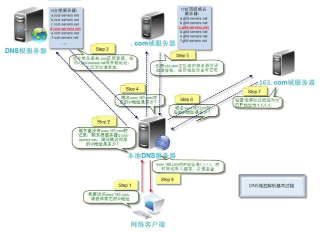
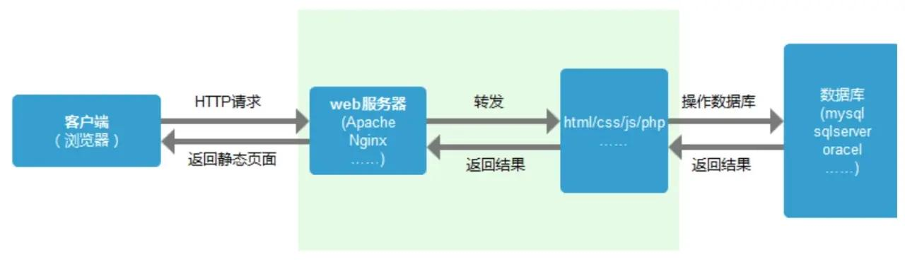
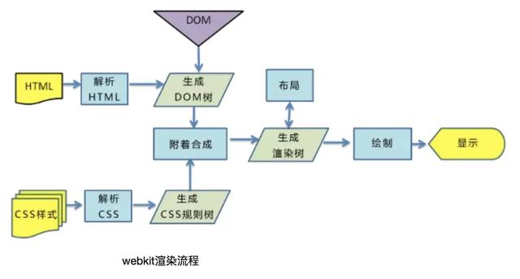

# 从输入url到页面展示出来，中间发生了什么？

## **首先是域名解析(DNS解析)**

- 首先浏览器解析输入的域名,先查找本地硬盘的host文件,看有没有和这个域名对应的ip,如果有,就直接使用这个ip.
- 如果没有,浏览器会发出一个DNS请求到本地DNS(域名分布系统)服务器.本地DNS服务器一般都是你的网络接入服务器商提供，比如中国电信，中国移动.
- 请求到达DNS服务器后,DNS服务器首先会查询他的缓存记录,如果有对应的ip地址,则返回,如果没有,本地DNS服务器向DNS根服务器发送查询请求.
- 根服务器不会记录具体的域名和ip的对应关系,而是返回域服务器的地址.本地服务器会继续向域服务器发起请求.
- 域服务器并没有记录域名和ip的对应关系,而是返回你的域名的解析服务器的地址.
- 本地DNS服务器继续向域名解析服务器发出请求,这时会收到域名对应的ip,本地DNS服务器将ip返回给浏览器,并将ip存入缓存,方便下次访问,加快访问速度.

## **建立TCP链接**

在拿到ip地址后,浏览器会向对应的web服务器(Nginx,Apache...)发起TCP连接请求,通过三次握手,建立TCP连接.

## **建立Http请求**

建立TCP连接后,浏览器向web服务器发送Http请求.

## **服务器处理Http请求**

服务器在接收到请求后,解析用户请求,知道了要调度那些资源文件,再通过相应的资源文件,处理用户的请求和参数,并调用数据库信息,最后讲结果通过web服务器返回给浏览器.

## **关闭TCP连接**

在这次数据传输完成后,为了避免服务器与客户端双方的资源占用和损耗,会经过四次挥手,关闭TCP连接.

## **浏览器解析资源**

在拿到html,css,js,图片等资源后,浏览器开始解析,通过解析HTML，生成DOM树，解析CSS，生成CSS规则树，然后通过DOM树和CSS规则树生成渲染树.

在解析CSS的同时，可以继续加载解析HTML，但在解析执行JS脚本时，会停止解析后续HTML，这就会出现阻塞问题.

## **浏览器渲染页面**

生成渲染树后,浏览器根据渲染树布局页面,同时计算css样式或js对Dom的动态样式改变,然后绘制出页面.

