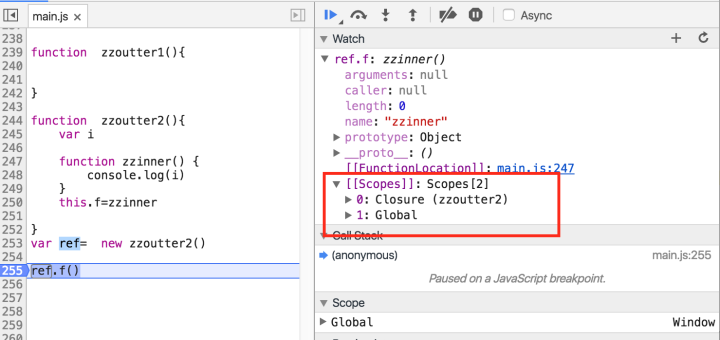
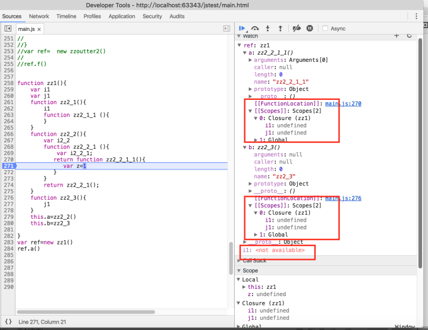
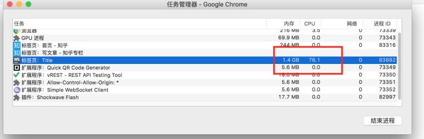

# JavaScript的闭包实现细节

JavaScript闭包直观上的说法就是：在存在函数嵌套的代码里，内层函数引用了外层函数的变量，从而产生些让初学者觉得很奇怪的行为。

```js
function calculator(){
  var num = 0;
  return function add(){
    console.log(num++)
  }
}
var cal = calculator()
cal();//0
cal();//1
cal();//2
```

文章主要分为：规范对闭包的定义，闭包的内部实现结构，闭包的隐含规则，以及闭包的垃圾回收风险三方面。

## 规范定义

ES规范并没有具体定义closure是什么，但从执行上下文里确实有描述相应的行为。

An Environment Record records the identifier bindings that are created within the scope of its associated Lexical Environment. It is referred to as the Lexical Environment’s EnvironmentRecord

The outer environment reference is used to model the logical nesting of Lexical Environment values. The outer reference of a (inner) Lexical Environment is a reference to the Lexical Environment that logically surrounds the inner Lexical Environment. An outer Lexical Environment may, of course, have its own outer Lexical Environment. A Lexical Environment may serve as the outer environment for multiple inner Lexical Environments. For example, **if a FunctionDeclaration contains two nested FunctionDeclarations then the Lexical Environments of each of the nested functions will have as their outer Lexical Environment the Lexical Environment of the current evaluation of the surrounding function.

## 内部结构

下面代码会产生闭包，内部函数对象创建以后，就可以通过[[scope]]观察到该函数依赖的作用域，当方法执行时[[scope]]对象的情况就直接创建函数上下文，同时创建新的local scope存储本地变量，如下图

函数对象创建后



函数执行过程


对程序员来讲，闭包直观的描述就是scope里面的closure，接下来主要通过分析堆的结构，找到对应的内存结构，如下图


从堆信息来看，有一个内部constructor closure()，生成了zzoutter1(),zzoutter2(),zzinner()函数对象，对象的原型__proto__都是237575，推测closure()就是函数的内部构造器Function，如果进一步展开也能找到对应的call，apply，bind等方法，因此闭包closure，在实现层面也指函数本身，但这里的闭包并不是我们要找的内容，如下图


接下来我们过滤zzouter2，找到zzoutter2的实例，再通过zzouter2的实例找到zzinner函数的实例，之所以这么做是由于代码并没有直接的new zzinner，js引擎就没有创建对应的实例，从下图可以看到zzouter2的实例237567持有f属性，f属性指向zzinner函数对象237569,跟上图有（closure）创建的对象id和原型__proto__都是一致的。

接下来观察zzinner函数对象的属性，其中有一个context对象，类型为system/context，context对象就直接包含我们debug面板看到的闭包信息。其中变量i就是编程直接相关的变量，另外native_context和previous指向同一个对象234439，closure指向i所处的函数zzouter2，从这里可以看出context对象是一个链表，链表的节点是闭包，会有一个属性closure指向上下文节点的变量所在函数对象，由于很难获取函数执行时的内存镜像，所以无法直观展示函数运行时的context，但从emca规范上看到，函数执行时的上下文就是local context，所以闭包在v8的准确定义就是一个内部的context对象，该对象引用了所有被内部函数引用过的对象，同时这个对象持有一个global上下文，一个previous指针指向上层的context，上层context也有可能是一个闭包结构的context，同时也指向闭包所在的函数。


## 隐含规则

闭包有一个规则比较隐蔽，很少引起关注，但如果错误使用闭包，可能带来一些潜在风险，下图例子1为：四层结构的函数嵌套。

**例子1：**


> **规则1**:闭包以外层函数为单位，只有被内部函数（不管嵌套多深）使用的变量才会纳入闭包里面
>
> **规则2**:内部函数特有的闭包，不仅仅包含内部函数的所需的变量：
>
> 如例子1，最里面的函数zzz2_2_1_1引用了i2_2_1和2_3，但从函数的上下文可以看出，闭包不仅仅包含这几个变量。
>
> **规则3**:内存函数的上下问链，只会关联存在闭包的函数上下文
>
> 如例子1，zzz2_2并不存在闭包，也就不会出现在zz2_2_1_1的上下文链里面。

**例子2:**




> **规则4**:内部函数没用引用外层函数变量，但如果其他内部函数引用了外层变量。这个内部函数依旧持有上下文中的闭包
>
> 如例子2 :zz2_2_1_1没有引用其他变量，但闭包还是存在。
>
> **规则5**:不同内部函数持有相同的外部函数闭包,也就是闭包中的变量对所有内部函数都是共享，不管这些函数何时执行，同步或者异步
>
> 如例子2 :zz1函数返回两个不同层次的内嵌函数，但他们指向的闭包都是同一个对象，从profile 堆区里看到都是对象142159
>
> **规则6**:文法上下文才可以访问
>
> 如例子2 :当执行函数zz2_2_1_时，存在闭包变量i1,但在watch上缺无法访问。这由于js规范中词法上下文做了约束
>
> **规则7**:值对象里的函数无法绑定闭包
>
> ```js
> var o={
>     i:0,
>     f1:function(){
>         //i 没有闭包,只能通过this,间接访问i
>         console.log("f1"+this.i);
>     },
>     f2:()=>{
>         //i 不光没有闭包,匿名函数的this无法切换,在这个匿名函数中永远也访问不来i
>         console.log("f2"+this.i);
>     }
> }
> o.f1.call(o)
> o.f2.call(o)
> o.f2()
> //输出:
> //f10
> //f2undefined
> //f2undefined
> ```
>
> **规则8**:常规函数闭包无法绑定this,匿名函数只能通过闭包绑定this
>
> ```js
> function data(){
>     this.i=0;
>     this.f1=function(){
>         //this没有闭包,只能通过this,间接访问i,this可以切换
>         console.log("f1"+this.i);
>     }
>     this.f2=()=>{
>         //this通过闭包实现,创建的时候决定了,后面无法改变
>         console.log("f2"+this.i);
>     }
> 
> }
> var d=new data()
> d.f1();
> d.f1.call({i:1})
> d.f2();
> d.f2.call({i:1})
> //结果
> //f10
> //f11
> //f20
> //f20
> ```
>
> **规则9**:闭包是编译已知，平行函数之间的闭包是隔离的，就算这个这两个方法运行在同一个stack上的上下两层。
>
> ```js
> function  f1() {
>     var j
>     function f1_1 (f2){
>         j
>         f2()//在f1的闭包环境下调用f2的内部函数
>     }
>     f1_1(f2)
> 
> 
> }
> 
> function  f2() {
>     var i;
>     (function  f2_1(){
>         console.log(i);
>         return function f2_3(){
>             console.log(j)//f2无法访问f1的闭包
>         }
>     })()()
> }
> f1()
> ```
>
> 

## 垃圾回收

从上诉例子可以发现，如果在一个树形的嵌套函数返回内部函数，再延迟执行。会导致该函数的上下文中所有闭包对应的变量生命周期跟捆绑到这个函数上，就算这个函数没有使用任何一个其中的任何一个变量。如果有大量这些函数延迟执行，尤其在后端系统，如果一个请求中途由于访问较慢的第三方服务时，就有可能导致不必要的变量存活，就放大内存溢出的风险。也有可能导致对象的回收赶不上对象的创建。

```js
function test(){
    function init(node) {

        var v1 = new Array(10000000);


        function f1(x, y) {
            //v1[0]=1
            console.log(1)
        }
        function f2() {
            //v1[0]=1
            console.log('2');

        };

        function f3() {
            //console.log(v1);
            console.log(v1);

        };
        return {f1:f1,f2:f2};
    }
    var res=init();
    function fb(){
        console.log("aasdfasfss")
    }
    setTimeout(res.f1,4000)
    setTimeout(res.f2,4000)
}
setInterval(test,1000) //不断忙于垃圾回收
//setInterval(test,100) 压力再大点就崩
```



